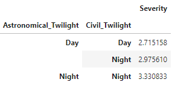

::: {.callout-note appearance="minimal" icon="false" title="Purpose"}
This assignment helps you identify the structure of a dataset before you begin
analyzing it.

You will inspect one project dataset, create an Excel table and pivot table,
identify its unit of analysis and variable types, and reflect on responsible AI
use.
:::

## Objectives

By the end of this assignment, you will be able to:

- determine whether a dataset follows tidy-data principles;
- distinguish dimensions from measures;
- identify the unit of analysis and grain;
- classify variables by type; and
- evaluate how AI supported or failed to support your work.

## Resources

- Week 1 slides on tidy data, unit of analysis, and variable types
- Data-description files in Canvas
- The four `.csv` files in the `data` folder
- Excel for the table and pivot-table tasks

::: {.callout-tip appearance="minimal" icon="false" title="Expectations"}
This assignment is graded for sincere completion and clear reasoning. Try every
step and document any difficulty you encounter.
:::

## 1) Choose and Download Your Dataset

Choose one project dataset from the `data` folder.

| Project dataset | Filename |
|---|---|
| Wisconsin traffic accidents | `accident_wi.csv` |
| Chicago Airbnb listings | `airbnb_chicago.csv` |
| Wisconsin hospital charges | `hospital_charges_wi.csv` |
| Mason Crosby special-teams plays | `nfl_special_MasonCrosby.csv` |

Download the `.csv` file from Posit Cloud and save a working copy as an Excel
workbook (`.xlsx`).

**Dataset selected:**

---

## 2) Evaluate Whether the Data Is Tidy

Use these tidy-data principles:

- each variable has its own column;
- each observation has its own row;
- each type of observational unit has its own table; and
- multiple related tables use keys.

In 3-5 sentences, explain whether your dataset is tidy. If it is not tidy,
identify the specific problem, such as a wide layout, mixed grains, repeated
headers, or units stored inside values.

*Your response:*

---

## 3) Format the Dataset as an Excel Table

In Excel, convert the dataset into an official table using `Ctrl/Cmd + T`.
Confirm that the table has headers and that the filters work.

No written response is required unless the conversion fails. If it fails,
briefly describe the problem and what you tried.

*Optional troubleshooting note:*

---

## 4) Build a Pivot Table

Create an Excel pivot table using at least:

- 1 dimension: a categorical descriptor such as location, date, or category;
- 1 measure: a numeric summary such as count, average, total, minimum, or
  maximum.

The example below places two categorical dimensions in the rows and summarizes
severity as a measure. Your variables and layout should match your own
analytical question.

{fig-alt="A small pivot table with Astronomical Twilight and Civil Twilight row categories and a summarized Severity column."}

In 2-4 sentences, name the dimensions and measures you used and explain what the
pivot table summarizes. If you encountered an error, describe it and what you
tried.

*Your response:*

---

## 5) Identify the Unit of Analysis

In 3-5 sentences, explain:

- what one row represents in your dataset;
- why this grain matters for the questions you can answer; and
- what additional information would appear if the grain were more detailed.

::: {.callout-important appearance="minimal" icon="false" title="Why Grain Matters"}
Rows are never just rows. If you misunderstand the unit of analysis, even
technically correct calculations can answer the wrong question.
:::

*Your response:*

---

## 6) Identify Variable Types

List at least one variable for every type represented in your dataset. When a
type is missing, state what additional data would be needed.

- **Categorical (nominal):**
- **Ordinal:**
- **True/false (logical):**
- **Discrete numeric:**
- **Continuous numeric:**
- **Date/time:**
- **Geographic/spatial:**

---

## 7) Reflect on Responsible AI Use

::: {.callout-warning appearance="minimal" icon="false" title="AI Policy"}
AI may support clarification, rewriting, or troubleshooting, but not analytical
decisions or interpretation. Verify every claim and submit work you understand.
:::

Write 5-7 sentences explaining how you used AI, the specific task it supported,
what it missed or oversimplified, and one prompt you used. Explain where the
response helped and where it fell short. If you did not use AI, explain why.

*Your response:*

## Submission

Submit these files in Canvas:

1. `Homework_01_IP.pdf`, containing your written responses; and
2. your completed Excel workbook (`.xlsx`), including the formatted table and
   pivot table.

Keep the workbook available for the in-class review.

## Checklist

- [ ] I selected one project dataset and created the required `.xlsx` workbook.
- [ ] I evaluated tidy structure, unit of analysis, and variable types.
- [ ] I created and explained an Excel table and pivot table.
- [ ] I completed the AI reflection and submitted the PDF and workbook.

**Grading focus:** Your work will be evaluated for correct identification of
data structure, clear use of dimensions and measures, complete responses, and
responsible evaluation of AI assistance.
