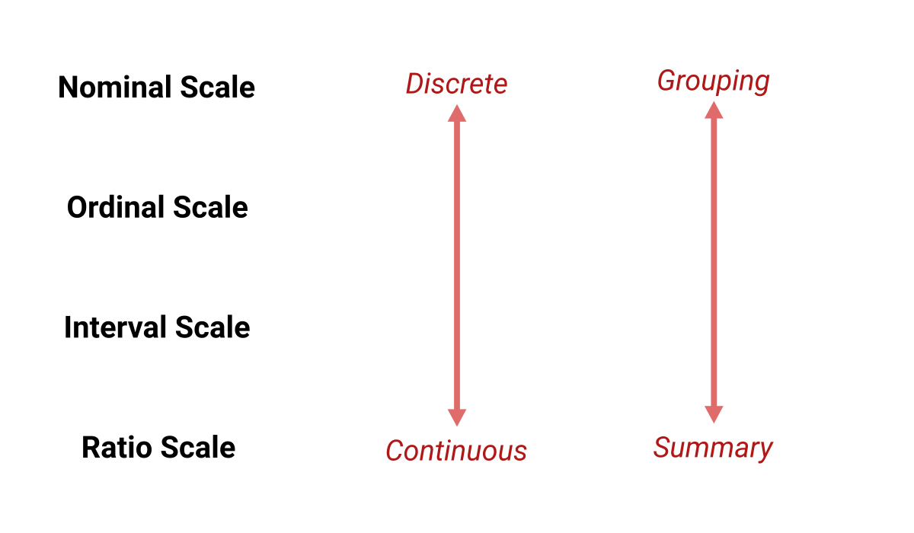
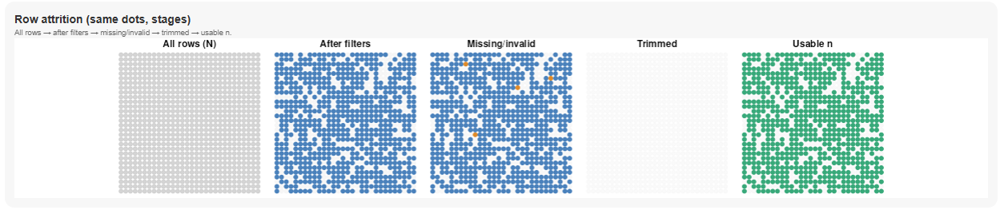
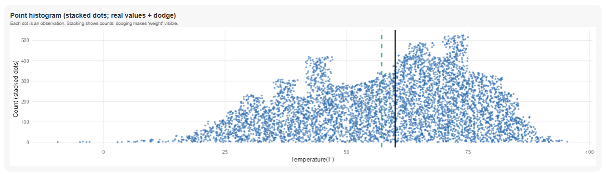
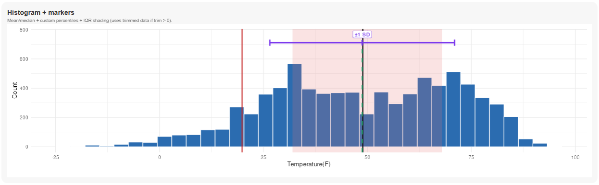
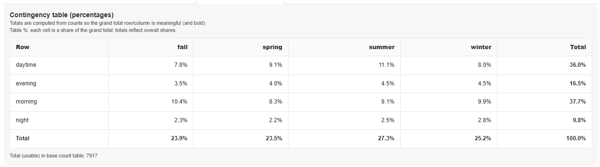
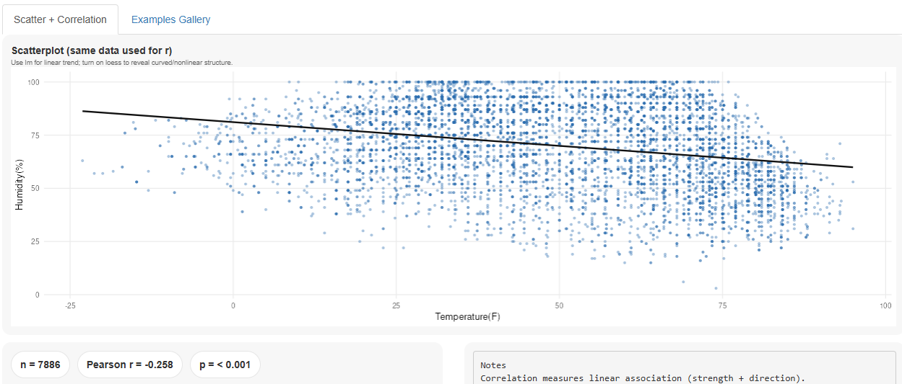

# Descriptive Measures

*How do we clearly describe the data we have?*

<br>

```{r acc_load, echo=FALSE}
library(shiny)
library(dplyr)
library(readr)
library(lubridate)
library(ggplot2)
library(stringr)
library(gt)
library(here)

# Reusable GT slide theme
source(here("shared","scripts","gt_boland.R"), local = TRUE)

`%||%` <- function(a, b) if (!is.null(a)) a else b

# Reproducible 7,900-row sample from the tracked Chicago 2024 extract.
COURSE_ROOT <- here()
source(here("week02", "scripts", "accident_clean.R"), local = TRUE)
acc_mast <- load_week02_crashes(COURSE_ROOT)

```

# Why summarize?

**Prompt:** *If you had 7,900 observations, what would you report first?*

```{r}
acc_mast %>%
  slice_sample(n = 20) %>%
  select(
    crash_datetime,
    time_period,
    reported_weather_condition,
    crash_type,
    temperature_f,
    relative_humidity_percent,
    wind_speed_mph,
    injuries_total
  ) %>%
  gt() %>%
  cols_label(
    crash_datetime = "Crash time",
    time_period = "Time period",
    reported_weather_condition = "Weather",
    crash_type = "Crash type",
    temperature_f = "Temp (F)",
    relative_humidity_percent = "Humidity (%)",
    wind_speed_mph = "Wind (mph)",
    injuries_total = "Injuries"
  ) %>%
  gt_boland(base_size = 7, tight = TRUE)
```

## Measurement Scales

{width="100%" height="700px" fig-alt="Visual representing measurement scales Nominal, Ordinal, Interval, Ratio and their common uses."}

## Measurement Scales

::::: columns
::: {.column width="30%"}
{width="100%" height="700px" fig-alt="Visual representing measurement scales Nominal, Ordinal, Interval, Ratio and their common uses."}
:::

::: {.column width="70%"}
```{r}
set.seed(230)

weather_examples <- acc_mast %>%
  filter(!is.na(reported_weather_condition)) %>%
  group_by(reported_weather_condition) %>%
  slice_sample(n = 1) %>%
  ungroup()

weather_fill <- acc_mast %>%
  filter(!crash_id %in% weather_examples$crash_id) %>%
  slice_sample(n = 20 - nrow(weather_examples))

bind_rows(weather_examples, weather_fill) %>%
  slice_sample(n = 20) %>%
  select(
    reported_weather_condition,
    time_period,
    temperature_f,
    wind_speed_mph,
    crash_datetime
  ) %>%
  gt() %>%
  cols_label(
    reported_weather_condition = "Weather (nominal)",
    time_period = "Time period (ordinal)",
    temperature_f = "Temperature (interval)",
    wind_speed_mph = "Wind speed (ratio)",
    crash_datetime = "Crash time (depends on use)"
  ) %>%
  gt_boland(base_size = 10, tight = TRUE)
```
:::
:::::

## [Meaningful Summaries by Scale Type]{.sr-only}

<br>

::: {.callout-tip title="Quick check"}
Which statistics are meaningful at each scale?
:::

<br>

- Count works best for **Nominal / Ordinal**
- Median & Percentiles work best for **Ordinal+**.
- Mean & Standard Deviation work best for **Interval / Ratio**.

<br>

:::: fragment
::: {.callout-important title="Textbook vs Real World"}
These rules are bent often; the real world is messy
:::
::::

## When SUM is meaningful {background-image="../shared/images/sum_notation.svg" background-position="right 24px bottom 42px" background-size="240px" background-repeat="no-repeat" fig-alt="N"}

<br>

- The variable is **additive**\
- Units can be **totaled** (minutes, dollars, people, rows)\
- **0** means 'none'

<br>

:::: fragment
::: tight-list
**Examples**

- Total minutes delayed

- Total injuries

- Number of severity 3 accidents (sum of 1/0)

- Total distance?
:::
::::

## When SUM is **not** meaningful {background-image="../shared/images/sum_notation.svg" background-position="right 24px bottom 42px" background-size="240px" background-repeat="no-repeat" fig-alt="N"}

<br>

- It's an **ID** or label\
- It's **ordinal** (e.g., severity 1–4)\
- It's already an **average/rate**

:::: fragment
::: tight-list
**Examples**

- Sum of accident IDs

- Sum of severity codes

- Sum of 'average speed' (unless weighted)

- Sum of temperature?
:::
::::

:::: fragment
::: {.callout-important title="Fast Test"}
Can you add two rows together and keep the same meaning + units?
:::
::::

# Measures of Size {background-image="../shared/images/sample_notation.svg" background-position="right 24px bottom 42px" background-size="240px" background-repeat="no-repeat" fig-alt="Sample size notation for population N, for sample n."}

## Sample size or Row Count {background-image="../shared/images/sample_notation.svg" background-position="right 24px bottom 42px" background-size="240px" background-repeat="no-repeat" fig-alt="Sample size notation for population N, for sample n."}

<br>

### Four counts to keep straight

<br>

- **N — Total records** in the dataset\
- **n~eligible~ — After filters** (date, severity, etc.)\
- **n~non-missing~ — Non‑missing for the chosen variable**\
- **n — Actual usable values** for our analysis

<br>

[](https://shiny.60land.com/week02/descriptives/)

# Measures of Center {background-image="../shared/images/mean_notation.svg" background-position="right 24px bottom 42px" background-size="240px" background-repeat="no-repeat" fig-alt="Average notation for population greek symbol mu, for sample x-bar, sometimes median notated with greek symbol eta."}

## Central Tendency {background-image="../shared/images/mean_notation.svg" background-position="right 24px bottom 42px" background-size="240px" background-repeat="no-repeat" fig-alt="Average notation for population greek symbol mu, for sample x-bar, sometimes median notated with greek symbol eta."}

<br>

### We have **three** common flavors—each answers a *different* question.

- **Mean**: balancing point; sensitive to outliers.

- **Median**: middle value; robust to skew/outliers.

- **Mode**: most frequent value; useful for categorical data.

<br>

[](https://shiny.60land.com/week02/descriptives/)

# Measures of Shape {background-image="../shared/images/stdev_notation.svg" background-position="right 24px bottom 42px" background-size="240px" background-repeat="no-repeat" fig-alt="Standard deviation notation for population greek symbol sigma, for sample s."}

## Standard Deviation {background-image="../shared/images/stdev_notation.svg" background-position="right 24px bottom 42px" background-size="240px" background-repeat="no-repeat" fig-alt="Standard deviation notation for population greek symbol sigma, for sample s."}

<br>

- **Variance (s^2^ or σ^2^):** average squared distance from the mean.

<br>

- **Standard deviation (s or σ):** typical distance in original units.

## Percentiles & Quartiles {background-image="../shared/images/quartile_notation.svg" background-position="right 24px bottom 42px" background-size="240px" background-repeat="no-repeat" fig-alt="Quartile notation same for population and sample nth quartile or nth percentile"}

<br>

### The *P*^th^ percentile is the value with *P*% of data at or below it.

- The 10^th^ percentile (P10) is the value where 10% of the distribution is lower and 90% is higher
- The 82^nd^ percentile (P82) is the value where 82% of the distribution is lower and 18% is higher
- Quartiles are P25 (Q1), P50 (Q2), P75 (Q3)
- The 50^th^ (P50) percentile, the 2^nd^ Quartile (Q2) and the Median are all the same value

[](https://shiny.60land.com/week02/descriptives/)

# Comparing Distributions

```{r dist_comp_plots}
# ============================================================
# Chicago crash dataset: 4 views for Temperature & Wind Speed
#   1) Base (hist + μ/σ)
#   2) Percentiles (P10/P25/P75/P90)
#   3) IQR shading (P25–P75)
#   4) Box + whiskers + tail dots (Shiny-style manual drawing)
# ============================================================

library(tidyverse)
library(ggplot2)
library(patchwork)

# ---- Reuse the seeded sample loaded above ----
acc <- acc_mast

# ---- Parameters ----
bins    <- 12                 # consistent binning across histogram views
pct_vec <- c(10, 25, 75, 90)  # percentiles to display (Pxx)

# Title/label spacing (more room for Pxx labels)
TITLE_GAP_B <- 18             # whitespace between title and panel
LABEL_VJUST <- 1.2            # keep labels inside the panel for reliable rendering

# Boxplot controls
SHOW_INLIER_DOTS <- FALSE     # FALSE matches your screenshot (only tails/outliers)
MAX_INLIERS      <- 3500      # subsample cap if inlier dots are on

# Colors
COL_TEMP     <- "#4C78A8"
COL_WIND     <- "#59A14F"
COL_LINE     <- "#D62728"
COL_IQR_FILL <- "#E15759"
ALPHA_IQR    <- 0.22

# ------------------------------------------------------------
# Shared theme fragment (title spacing applied everywhere)
# ------------------------------------------------------------
theme_title_spaced <- function(base_size = 13) {
  theme_minimal(base_size = base_size) +
    theme(
      plot.title.position = "plot",
      plot.title = element_text(
        face = "bold",
        hjust = 0.5,
        margin = margin(b = TITLE_GAP_B)
      ),
      panel.grid.minor = element_blank(),
      plot.margin = margin(10, 10, 10, 10)
    )
}

# ------------------------------------------------------------
# Helper 1: Base panel = histogram + stats underneath
# ------------------------------------------------------------
make_hist_with_stats <- function(data, var, title,
                                 bins = 12,
                                 fill = "#4C78A8",
                                 mean_digits = 3,
                                 sd_digits = 2) {

  x <- suppressWarnings(as.numeric(data[[var]]))
  x <- x[is.finite(x)]

  mu  <- mean(x)
  sig <- sd(x)

  p_hist <- ggplot(tibble(x = x), aes(x)) +
    geom_histogram(bins = bins, fill = fill, color = "white") +
    labs(title = title, x = title, y = "Count") +
    theme_title_spaced(base_size = 13) +
    theme(plot.margin = margin(10, 10, 0, 10))  # tighter to stats block

  p_stats <- ggplot() +
    annotate(
      "text", x = 0, y = 0,
      label = paste0(
        "Mean = ", format(round(mu, mean_digits), nsmall = mean_digits), "\n",
        "SD = ", format(round(sig, sd_digits), nsmall = sd_digits)
      ),
      size = 7
    ) +
    xlim(-1, 1) + ylim(-1, 1) +
    theme_void() +
    theme(plot.margin = margin(0, 10, 10, 10))

  p_hist / p_stats + plot_layout(heights = c(3, 1))
}

# ------------------------------------------------------------
# Helper 2: Percentile panel = histogram + vlines + labels (Pxx)
# ------------------------------------------------------------
make_hist_percentiles <- function(data, var, title,
                                  bins = 12,
                                  fill = "#4C78A8",
                                  pcts = c(10, 25, 75, 90),
                                  line_col = "#D62728") {

  x <- suppressWarnings(as.numeric(data[[var]]))
  x <- x[is.finite(x)]

  qs <- as.numeric(quantile(x, probs = pcts/100, na.rm = TRUE, type = 7))
  hist_probe <- ggplot_build(
    ggplot(tibble(x = x), aes(x)) + geom_histogram(bins = bins)
  )
  y_max <- max(hist_probe$data[[1]]$count, na.rm = TRUE)
  df_q <- tibble(
    pct = pcts,
    q = qs,
    label_y = y_max * rep(c(0.97, 0.88), length.out = length(pcts))
  )

  ggplot(tibble(x = x), aes(x)) +
    geom_histogram(bins = bins, fill = fill, color = "white") +
    geom_vline(data = df_q, aes(xintercept = q),
               color = line_col, linewidth = 1.0, alpha = 0.9) +
    geom_text(
      data = df_q,
      aes(x = q, y = label_y, label = paste0("P", pct)),
      vjust = 0.5, size = 4, color = "black"
    ) +
    labs(title = title, x = title, y = "Count") +
    theme_title_spaced(base_size = 13)
}

# ------------------------------------------------------------
# Helper 3: IQR panel = shaded P25–P75 + vlines + labels
# ------------------------------------------------------------
make_hist_iqr <- function(data, var, title,
                          bins = 12,
                          fill = "#4C78A8",
                          shade_fill = "#E15759",
                          shade_alpha = 0.22,
                          line_col = "#D62728") {

  x <- suppressWarnings(as.numeric(data[[var]]))
  x <- x[is.finite(x)]

  q <- as.numeric(quantile(x, probs = c(.25, .75), na.rm = TRUE, type = 7))
  q1 <- q[1]; q3 <- q[2]

  ggplot(tibble(x = x), aes(x)) +
    annotate("rect",
             xmin = q1, xmax = q3,
             ymin = -Inf, ymax = Inf,
             fill = shade_fill, alpha = shade_alpha) +
    geom_histogram(bins = bins, fill = fill, color = "white") +
    geom_vline(xintercept = c(q1, q3),
               color = line_col, linewidth = 1.1, alpha = 0.95) +
    geom_text(
      data = tibble(q = c(q1, q3), lab = c("P25", "P75")),
      aes(x = q, y = Inf, label = lab),
      vjust = LABEL_VJUST, size = 4, color = "black"
    ) +
    labs(title = title, x = title, y = "Count") +
    theme_title_spaced(base_size = 13) +
    coord_cartesian(clip = "off")
}

# ------------------------------------------------------------
# Helper 4: Box + whiskers + tail dots (Shiny-style manual drawing)
# ------------------------------------------------------------
make_boxplot_shiny_style <- function(data, var, title,
                                     color = "#4C78A8",
                                     show_inlier_dots = FALSE,
                                     max_inliers = 3500,
                                     inlier_alpha = 0.25,
                                     inlier_size  = 1.05,
                                     outlier_alpha = 0.90,
                                     outlier_size  = 1.35,
                                     box_w = 0.10,
                                     cap_w_mult = 0.80) {

  x <- suppressWarnings(as.numeric(data[[var]]))
  x <- x[is.finite(x)]

  if (length(x) == 0) {
    return(ggplot() + theme_void() + ggtitle(paste0(title, " (no data)")))
  }
  if (length(x) < 2) {
    return(
      ggplot(data.frame(x = x, y = 1), aes(x, y)) +
        geom_point(color = color, size = 2) +
        scale_y_continuous(NULL, breaks = NULL) +
        labs(title = title, x = title, y = NULL) +
        theme_title_spaced(base_size = 13)
    )
  }

  # Tukey boxplot stats (1.5*IQR whiskers) and outliers
  bp <- boxplot.stats(x)
  s5 <- bp$stats
  lowW <- s5[1]; q1 <- s5[2]; med <- s5[3]; q3 <- s5[4]; hiW <- s5[5]

  is_out <- (x < lowW) | (x > hiW)
  x_out <- x[is_out]
  x_in  <- x[!is_out]

  # Optional subsample inliers
  set.seed(230)
  if (length(x_in) > max_inliers) x_in <- sample(x_in, max_inliers)

  y0 <- 1
  df_in  <- data.frame(x = x_in,  y = rep(y0, length(x_in)))
  df_out <- data.frame(x = x_out, y = rep(y0, length(x_out)))

  cap_w <- box_w * cap_w_mult
  n_in <- nrow(df_in)
  jitter_h <- min(0.22, 0.05 + 0.04 * log10(n_in + 1))

  p <- ggplot() +
    # box
    geom_rect(aes(xmin = q1, xmax = q3, ymin = y0 - box_w/2, ymax = y0 + box_w/2),
              fill = "grey88", color = "grey35") +
    # median
    geom_segment(aes(x = med, xend = med, y = y0 - box_w/2, yend = y0 + box_w/2),
                 color = "grey35", linewidth = 1.1) +
    # whiskers
    geom_segment(aes(x = lowW, xend = q1, y = y0, yend = y0), color = "grey35") +
    geom_segment(aes(x = q3, xend = hiW, y = y0, yend = y0), color = "grey35") +
    # caps
    geom_segment(aes(x = lowW, xend = lowW, y = y0 - cap_w/2, yend = y0 + cap_w/2), color = "grey35") +
    geom_segment(aes(x = hiW,  xend = hiW,  y = y0 - cap_w/2, yend = y0 + cap_w/2), color = "grey35")

  # optional inlier dots
  if (isTRUE(show_inlier_dots) && nrow(df_in) > 0) {
    p <- p +
      geom_jitter(data = df_in, aes(x = x, y = y),
                  height = jitter_h, width = 0,
                  alpha = inlier_alpha, size = inlier_size, color = color)
  }

  # outliers always visible
  if (nrow(df_out) > 0) {
    p <- p +
      geom_point(data = df_out, aes(x = x, y = y),
                 alpha = outlier_alpha, size = outlier_size, color = color)
  }

  p +
    scale_y_continuous(NULL, breaks = NULL, limits = c(y0 - 0.28, y0 + 0.28)) +
    labs(title = title, x = title, y = NULL) +
    theme_title_spaced(base_size = 13) +
    theme(panel.grid.major.y = element_blank(),
          panel.grid.minor = element_blank())
}

# ============================================================
# Build the 4 views (each is two-panel: Temperature | Wind Speed)
# ============================================================

# --- 1) Base (μ/σ under each) ---
p_temp_base <- make_hist_with_stats(
  acc, "temperature_f", "Temperature (F)",
  bins = bins, fill = COL_TEMP,
  mean_digits = 2, sd_digits = 2
)

p_wind_base <- make_hist_with_stats(
  acc, "wind_speed_mph", "Wind speed (mph)",
  bins = bins, fill = COL_WIND,
  mean_digits = 2, sd_digits = 2
)

plot_base <- p_temp_base | p_wind_base

# --- 2) Percentiles ---
p_temp_pct <- make_hist_percentiles(
  acc, "temperature_f", "Temperature (F)",
  bins = bins, fill = COL_TEMP,
  pcts = pct_vec, line_col = COL_LINE
)

p_wind_pct <- make_hist_percentiles(
  acc, "wind_speed_mph", "Wind speed (mph)",
  bins = bins, fill = COL_WIND,
  pcts = pct_vec, line_col = COL_LINE
)

plot_percentiles <- p_temp_pct | p_wind_pct

# --- 3) IQR shading ---
p_temp_iqr <- make_hist_iqr(
  acc, "temperature_f", "Temperature (F)",
  bins = bins, fill = COL_TEMP,
  shade_fill = COL_IQR_FILL, shade_alpha = ALPHA_IQR,
  line_col = COL_LINE
)

p_wind_iqr <- make_hist_iqr(
  acc, "wind_speed_mph", "Wind speed (mph)",
  bins = bins, fill = COL_WIND,
  shade_fill = COL_IQR_FILL, shade_alpha = ALPHA_IQR,
  line_col = COL_LINE
)

plot_iqr <- p_temp_iqr | p_wind_iqr

# --- 4) Box + tails (Shiny-style) ---
p_temp_box <- make_boxplot_shiny_style(
  acc, "temperature_f", "Temperature (F)",
  color = COL_TEMP,
  show_inlier_dots = SHOW_INLIER_DOTS,
  max_inliers = MAX_INLIERS
)

p_wind_box <- make_boxplot_shiny_style(
  acc, "wind_speed_mph", "Wind speed (mph)",
  color = COL_WIND,
  show_inlier_dots = SHOW_INLIER_DOTS,
  max_inliers = MAX_INLIERS
)

plot_box <- p_temp_box | p_wind_box


```

## Mean and SD

#### *Unstandardized measures depend on the units being measured*

```{r}
plot_base
```

## Percentiles

#### *Standardized measures do not depend on units being measured*

```{r}
plot_percentiles
```

## IQR - Inter-Quartile Range

```{r}
plot_iqr
```

## Boxplots or Box & Whisker Plots

```{r}
plot_box
```

# Relationships: Discrete to Discrete {background-image="../shared/images/NOIR.svg" background-position="right 24px bottom 42px" background-size="480px" background-repeat="no-repeat" fig-alt="Visual representing measurement scales Nominal, Ordinal, Interval, Ratio and their common uses."}

## Cross Tabs or Contingency Tables

### **Start with counts; then layer in percentages.**

<br>

- Frequncy Table - \***One** Categorical Variable
- Cross Tab - **Two** Categorical Variables
- Count how many rows **n**
- Add **marginal totals**

<br>

::: tight-list
**Compute Percentages**

- **row %** (conditional on row)

- **column %** (conditional on column)

- **table %** for overall share
:::

## What can go wrong?

[](https://shiny.60land.com/week02/crosstabs/)

::: fragment
**Confusing similar-sounding percentages**:
:::

::: fragment
- \% of incidents that happened in Spring **and** in the Morning?
:::

::: fragment
- \% of incidents in the Spring that happened in the Morning?
:::

::: fragment
- \% of incidents that happened in the Spring?
:::

:::: fragment
::: {.callout-important title="Percentage Problems"}
Make sure you are clear on what the numerator and denominator are and communicate clearly.
:::
::::

# Relationships - Continuous to Continuous {background-image="../shared/images/NOIR.svg" background-position="right 24px bottom 42px" background-size="480px" background-repeat="no-repeat" fig-alt="Visual representing measurement scales Nominal, Ordinal, Interval, Ratio and their common uses."}

## Correlation {background-image="../shared/images/correlation_notation.svg" background-position="right 24px bottom 42px" background-size="240px" background-repeat="no-repeat" fig-alt="Coefficient of correlation notation for population greek symbol capital rho or r, for sample lower case rho or r"}

- **Correlation (r):** standardized between -1 and +1
- Shows strength of *linear* pattern.
- +1 means positive relationship, -1 means netagive relationship
- Does not determine the slope of the line
- Regression analysis needed for full understanding

:::: fragment
::: callout-caution
**Correlation ≠ Causation.** Check for confounders, nonlinearity, and outliers. E.g. perform a full regression analysis.
:::
::::

::::: columns
:::: {.column width="70%"}
::: fragment
[](https://shiny.60land.com/week02/correlation/)
:::
::::
:::::

# Relationships: Discrete to Continuous {background-image="../shared/images/NOIR.svg" background-position="right 24px bottom 42px" background-size="480px" background-repeat="no-repeat" fig-alt="Visual representing measurement scales Nominal, Ordinal, Interval, Ratio and their common uses."}

## **Analytics** is the **art** of finding out what is in your data.

```{r group_means, echo=TRUE, results="hide"}
acc_mast %>%
  select(temperature_f, season) %>%
  filter(!is.na(temperature_f), !is.na(season)) %>%
  group_by(season) %>%
  summarise(
    n = n(),
    mean_temp = mean(temperature_f),
    median_temp = median(temperature_f)
  )
```

::: fragment
```{r group_means_show, echo=FALSE, results="show"}
acc_sum <- acc_mast %>%
  select(temperature_f, season) %>%
  filter(!is.na(temperature_f), !is.na(season)) %>%
  group_by(season) %>%
  summarise(
    n = n(),
    mean_temp = mean(temperature_f),
    median_temp = median(temperature_f)
  )


  acc_sum %>%
  gt() %>%
  gt_boland(base_size = 10, tight = FALSE)
```
:::

::: fragment
```{r group_sd, echo=TRUE, results="hide"}
acc_mast %>%
  select(wind_speed_mph, time_period) %>%
  filter(!is.na(wind_speed_mph), !is.na(time_period)) %>%
  group_by(time_period) %>%
  summarise(mean_wind = mean(wind_speed_mph), stdev_wind = sd(wind_speed_mph))
```
:::

::: fragment
```{r group_sd_show, echo=FALSE, results="show"}
acc_sd <- acc_mast %>%
  select(wind_speed_mph, time_period) %>%
  filter(!is.na(wind_speed_mph), !is.na(time_period)) %>%
  group_by(time_period) %>%
  summarise(mean_wind = mean(wind_speed_mph), stdev_wind = sd(wind_speed_mph))


  acc_sd %>%
  gt() %>%
  gt_boland(base_size = 10, tight = FALSE)
```
:::

# Descriptive Measures

*How do we clearly describe the data we have?*

<br>

- Size
- Center
- Shape
- Relationships

:::: fragment
::: {.callout-tip title="Story Time"}
Think of your dataset. Which two descriptive measures would you lead with and why?
:::
::::
