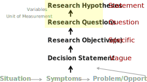
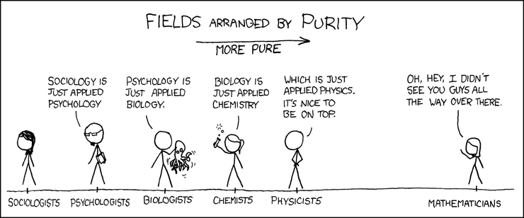
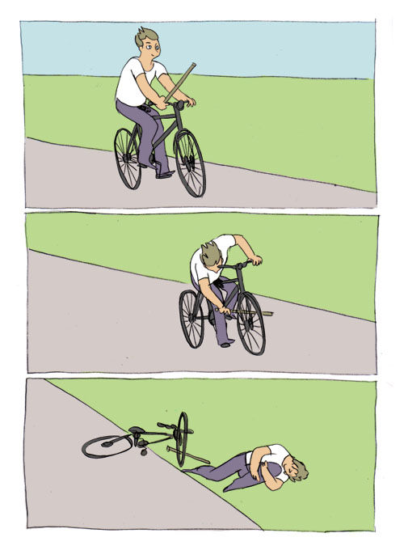

##  {background-color="black"}

::: text-center
<br><br><br>

[ “If it disagrees with experiment, it’s ]{style="font-size: 2.1em; font-style: italic; line-height: 1.25;"}[WRONG]{style="color:#e31b23; font-weight:700;"}. In<br> that simple statement is the key to science”

<br><br>

[—Richard Feynman]{style="font-size: 1.2em; opacity: 0.65;"}
:::

## Research Design

{width="100%" height="700px" fig-alt="Visual representing measurement scales Nominal, Ordinal, Interval, Ratio and their common uses."}

## [What is a hypothesis]{.sr-only}

{width="85%"}

::: fragment
*What are we interested in?*
:::

::: fragment
*At what level can we measure it practically?*
:::

::: fragment
*Rigor of science vs. pragmatics of business*
:::

:::: fragment
::: {.callout-important title="Hypothesis"}
**How do the things we are measuring work together?**
:::
::::

## Science {auto-animate="true" background-color="white"}

:::::::: {style="position: relative; height: 560px;"}
<!-- HEADERS (same style) -->

::: {style="position:absolute; top: 40px; width:100%; text-align:center; font-size:1.8em; font-weight:700;"}
What just happened? (Observation)
:::

<!-- MOVING LINE (stable id) -->

::: {data-id="tracker" style="position:absolute; left:12%; right:12%; top: 110px; height:4px; background:#b33;"}
:::

::: {style="position:absolute; top: 175px; width:100%; text-align:center; font-size:1.8em; font-weight:700;"}
Why? (Hypothesis)
:::

::: {style="position:absolute; top: 305px; width:100%; text-align:center; font-size:1.8em; font-weight:700;"}
Oh, that’s probably why. (Theory)
:::

::: {style="position:absolute; bottom: 15px; width:100%; text-align:center; font-size:1.8em; font-weight:800;"}
The Fundamental Rules (Law)
:::
::::::::

------------------------------------------------------------------------

## Science {auto-animate="true" background-color="white"}

:::::::: {style="position: relative; height: 560px;"}
::: {style="position:absolute; top: 40px; width:100%; text-align:center; font-size:1.8em; font-weight:700;"}
What just happened? (Observation)
:::

::: {data-id="tracker" style="position:absolute; left:12%; right:12%; top: 155px; height:4px; background:#b33;"}
:::

::: {style="position:absolute; top: 175px; width:100%; text-align:center; font-size:1.8em; font-weight:700;"}
Why? (Hypothesis)
:::

::: {style="position:absolute; top: 305px; width:100%; text-align:center; font-size:1.8em; font-weight:700;"}
Oh, that’s probably why. (Theory)
:::

::: {style="position:absolute; bottom: 15px; width:100%; text-align:center; font-size:1.8em; font-weight:800;"}
The Fundamental Rules (Law)
:::
::::::::

------------------------------------------------------------------------

## Science {auto-animate="true" background-color="white"}

:::::::: {style="position: relative; height: 560px;"}
::: {style="position:absolute; top: 40px; width:100%; text-align:center; font-size:1.8em; font-weight:700;"}
What just happened? (Observation)
:::

::: {data-id="tracker" style="position:absolute; left:12%; right:12%; top: 220px; height:4px; background:#b33;"}
:::

::: {style="position:absolute; top: 175px; width:100%; text-align:center; font-size:1.8em; font-weight:700;"}
Why? (Hypothesis)
:::

::: {style="position:absolute; top: 305px; width:100%; text-align:center; font-size:1.8em; font-weight:700;"}
Oh, that’s probably why. (Theory)
:::

::: {style="position:absolute; bottom: 15px; width:100%; text-align:center; font-size:1.8em; font-weight:800;"}
The Fundamental Rules (Law)
:::
::::::::

------------------------------------------------------------------------

## Science {auto-animate="true" background-color="white"}

:::::::: {style="position: relative; height: 560px;"}
::: {style="position:absolute; top: 40px; width:100%; text-align:center; font-size:1.8em; font-weight:700;"}
What just happened? (Observation)
:::

::: {data-id="tracker" style="position:absolute; left:12%; right:12%; top: 285px; height:4px; background:#b33;"}
:::

::: {style="position:absolute; top: 175px; width:100%; text-align:center; font-size:1.8em; font-weight:700;"}
Why? (Hypothesis)
:::

::: {style="position:absolute; top: 305px; width:100%; text-align:center; font-size:1.8em; font-weight:700;"}
Oh, that’s probably why. (Theory)
:::

::: {style="position:absolute; bottom: 15px; width:100%; text-align:center; font-size:1.8em; font-weight:800;"}
The Fundamental Rules (Law)
:::
::::::::

------------------------------------------------------------------------

## Science {auto-animate="true" background-color="white"}

:::::::: {style="position: relative; height: 560px;"}
::: {style="position:absolute; top: 40px; width:100%; text-align:center; font-size:1.8em; font-weight:700;"}
What just happened? (Observation)
:::

::: {data-id="tracker" style="position:absolute; left:12%; right:12%; top: 350px; height:4px; background:#b33;"}
:::

::: {style="position:absolute; top: 175px; width:100%; text-align:center; font-size:1.8em; font-weight:700;"}
Why? (Hypothesis)
:::

::: {style="position:absolute; top: 305px; width:100%; text-align:center; font-size:1.8em; font-weight:700;"}
Oh, that’s probably why. (Theory)
:::

::: {style="position:absolute; bottom: 15px; width:100%; text-align:center; font-size:1.8em; font-weight:800;"}
The Fundamental Rules (Law)
:::
::::::::

------------------------------------------------------------------------

## Science {auto-animate="true" background-color="white"}

:::::::: {style="position: relative; height: 560px;"}
::: {style="position:absolute; top: 40px; width:100%; text-align:center; font-size:1.8em; font-weight:700;"}
What just happened? (Observation)
:::

::: {data-id="tracker" style="position:absolute; left:12%; right:12%; top: 455px; height:4px; background:#b33;"}
:::

::: {style="position:absolute; top: 175px; width:100%; text-align:center; font-size:1.8em; font-weight:700;"}
Why? (Hypothesis)
:::

::: {style="position:absolute; top: 305px; width:100%; text-align:center; font-size:1.8em; font-weight:700;"}
Oh, that’s probably why. (Theory)
:::

::: {style="position:absolute; bottom: 15px; width:100%; text-align:center; font-size:1.8em; font-weight:800;"}
The Fundamental Rules (Law)
:::
::::::::

::: {.callout-important title="Rules (Laws) Don't Change"}
What we **'know'** changes with our understanding
:::

## Game Simulator

::: {style="display:flex; align-items:center; justify-content:center; height:70vh;"}
<a href="https://shiny.60land.com/week05/" target="_blank" rel="noopener"
   style="display:inline-flex; align-items:center; justify-content:center; width:220px; height:220px; border-radius:50%; background:#000; text-decoration:none;"
   aria-label="Open the Game Simulator Shiny app (opens in a new tab)."> </a>
:::

## Relationships

<br>

:::::: columns
::: {.column width="40%"}
### Independent Variable

<br>

On/Off Campus\
GPA\
Exercise\
BMI

<br>

*Keep track of (control)*\
*Input*
:::

::: {.column width="20%"}
*affects*
:::

::: {.column width="40%"}
### Dependent Variable

<br>

GPA\
On/Off Campus\
BMI\
Exercise

<br>

*Measure outcome*\
*Prediction*
:::
::::::

::: {.callout-important .fragment title="Hypothesis"}
An educated guess about how the **independent variable** affects the **dependent variable**.
:::

## Pseudo Code

```{r setup_eco, echo=FALSE}
library(eco230r)
library(dplyr)
library(readr)
library(here)
data_path     <- here("shared", "data", "accident_wi.csv")

# 1) Load data --------------------------------------------------------------
abnb <- read_csv(data_path, show_col_types = FALSE)
```

::::: columns
::: {.column width="10%"}
{width="100%" fig-alt="R Language Logo"}
:::

::: {.column width="90%"}
```{r pseudo, echo=TRUE, results="hide"}
#load the raw data set
#Add population information by zip code
#Select Population, Duration, Temperature…
#Create a measure that is a ratio between temp/duration
#Test Hypothesis duration longer with higher population
#I tried idt(duration~population) it didn’t work
```
:::
:::::

## Pseudo Code to Real Code

::::: columns
::: {.column width="10%"}
{width="100%" fig-alt="R Language Logo"}
:::

::: {.column width="90%"}
```{r pseudo_real, echo=TRUE, results="show"}
#load the raw data set
df <- read_csv("../shared/data/accident_wi.csv")

#Add population information by zip code

#Select Population, Duration, Temperature…

#Create a measure that is a ratio between temp/distance

df <- df %>%
  mutate(temp_dist_ratio = `Temperature(F)`/`Distance(mi)`)

#Test Hypothesis duration longer with higher population
#I tried idt(duration~population) it didn’t work

df %>%
  idt(`Distance(mi)`~Sunrise_Sunset)

```
:::
:::::

## Group Project Template {data-background-image="media/images/w5_posit_example.png" background-size="auto 80%" data-background-position="center" data-background-repeat="no-repeat"}

## Procrastination {background-color="white"}

:::::: {style="position: relative; height: 560px;"}
<!-- Meme image --> 

<!-- Top panel caption -->

::: {.fragment style="position:absolute; left:65%; top:140px; width:260px;
              font-size:1.1em; font-weight:600;"}
```         
Me planning to get my
posit.cloud project to work
```
:::

<!-- Middle panel caption -->

::: {.fragment style="position:absolute; left:65%; top:300px; width:260px;
              font-size:1.1em; font-weight:600;"}
```         
Starting 15 minutes before
it is due
```
:::

<!-- Bottom panel caption -->

::: {.fragment style="position:absolute; left:65%; top:455px; width:260px;
              font-size:1.1em; font-weight:600;"}
```         
🔥🔥🔥
```
:::
::::::
