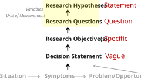
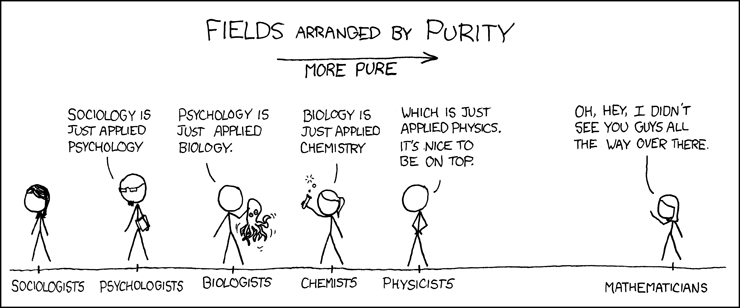
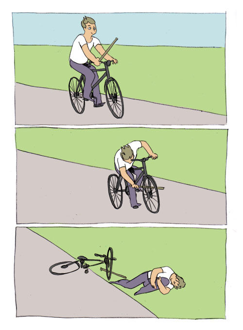

##  {background-color="black"}

::: text-center
<br><br><br>

<p style="font-size: 2.1em; font-style: italic; line-height: 1.25;">"If it disagrees with experiment, it's <span style="color:#e31b23; font-weight:700;">WRONG</span>. In<br> that simple statement is the key to science"</p>

<br><br>

[- Richard Feynman]{style="font-size: 1.2em; opacity: 0.65;"}
:::

## Research Design

{width="100%" height="700px" fig-alt="Visual representing measurement scales Nominal, Ordinal, Interval, Ratio and their common uses."}

## [What is a hypothesis]{.sr-only}

{width="85%"}

::: fragment
*What are we interested in?*
:::

::: fragment
*At what level can we measure it practically?*
:::

::: fragment
*Rigor of science vs. pragmatics of business*
:::

:::: fragment
::: {.callout-important title="Hypothesis"}
**How do the things we are measuring work together?**
:::
::::

## Science {auto-animate="true" background-color="white"}

:::::::: {style="position: relative; height: 560px;"}
<!-- HEADERS (same style) -->

::: {style="position:absolute; top: 40px; width:100%; text-align:center; font-size:1.8em; font-weight:700;"}
What just happened? (Observation)
:::

<!-- MOVING LINE (stable id) -->

::: {data-id="tracker" style="position:absolute; left:12%; right:12%; top: 110px; height:4px; background:#b33;"}
:::

::: {style="position:absolute; top: 175px; width:100%; text-align:center; font-size:1.8em; font-weight:700;"}
Why? (Hypothesis)
:::

::: {style="position:absolute; top: 305px; width:100%; text-align:center; font-size:1.8em; font-weight:700;"}
Oh, that’s probably why. (Theory)
:::

::: {style="position:absolute; bottom: 15px; width:100%; text-align:center; font-size:1.8em; font-weight:800;"}
The Fundamental Rules (Law)
:::
::::::::

------------------------------------------------------------------------

## Science {auto-animate="true" background-color="white"}

:::::::: {style="position: relative; height: 560px;"}
::: {style="position:absolute; top: 40px; width:100%; text-align:center; font-size:1.8em; font-weight:700;"}
What just happened? (Observation)
:::

::: {data-id="tracker" style="position:absolute; left:12%; right:12%; top: 155px; height:4px; background:#b33;"}
:::

::: {style="position:absolute; top: 175px; width:100%; text-align:center; font-size:1.8em; font-weight:700;"}
Why? (Hypothesis)
:::

::: {style="position:absolute; top: 305px; width:100%; text-align:center; font-size:1.8em; font-weight:700;"}
Oh, that’s probably why. (Theory)
:::

::: {style="position:absolute; bottom: 15px; width:100%; text-align:center; font-size:1.8em; font-weight:800;"}
The Fundamental Rules (Law)
:::
::::::::

------------------------------------------------------------------------

## Science {auto-animate="true" background-color="white"}

:::::::: {style="position: relative; height: 560px;"}
::: {style="position:absolute; top: 40px; width:100%; text-align:center; font-size:1.8em; font-weight:700;"}
What just happened? (Observation)
:::

::: {data-id="tracker" style="position:absolute; left:12%; right:12%; top: 220px; height:4px; background:#b33;"}
:::

::: {style="position:absolute; top: 175px; width:100%; text-align:center; font-size:1.8em; font-weight:700;"}
Why? (Hypothesis)
:::

::: {style="position:absolute; top: 305px; width:100%; text-align:center; font-size:1.8em; font-weight:700;"}
Oh, that’s probably why. (Theory)
:::

::: {style="position:absolute; bottom: 15px; width:100%; text-align:center; font-size:1.8em; font-weight:800;"}
The Fundamental Rules (Law)
:::
::::::::

------------------------------------------------------------------------

## Science {auto-animate="true" background-color="white"}

:::::::: {style="position: relative; height: 560px;"}
::: {style="position:absolute; top: 40px; width:100%; text-align:center; font-size:1.8em; font-weight:700;"}
What just happened? (Observation)
:::

::: {data-id="tracker" style="position:absolute; left:12%; right:12%; top: 285px; height:4px; background:#b33;"}
:::

::: {style="position:absolute; top: 175px; width:100%; text-align:center; font-size:1.8em; font-weight:700;"}
Why? (Hypothesis)
:::

::: {style="position:absolute; top: 305px; width:100%; text-align:center; font-size:1.8em; font-weight:700;"}
Oh, that’s probably why. (Theory)
:::

::: {style="position:absolute; bottom: 15px; width:100%; text-align:center; font-size:1.8em; font-weight:800;"}
The Fundamental Rules (Law)
:::
::::::::

------------------------------------------------------------------------

## Science {auto-animate="true" background-color="white"}

:::::::: {style="position: relative; height: 560px;"}
::: {style="position:absolute; top: 40px; width:100%; text-align:center; font-size:1.8em; font-weight:700;"}
What just happened? (Observation)
:::

::: {data-id="tracker" style="position:absolute; left:12%; right:12%; top: 350px; height:4px; background:#b33;"}
:::

::: {style="position:absolute; top: 175px; width:100%; text-align:center; font-size:1.8em; font-weight:700;"}
Why? (Hypothesis)
:::

::: {style="position:absolute; top: 305px; width:100%; text-align:center; font-size:1.8em; font-weight:700;"}
Oh, that’s probably why. (Theory)
:::

::: {style="position:absolute; bottom: 15px; width:100%; text-align:center; font-size:1.8em; font-weight:800;"}
The Fundamental Rules (Law)
:::
::::::::

------------------------------------------------------------------------

## Science {auto-animate="true" background-color="white"}

:::::::: {style="position: relative; height: 560px;"}
::: {style="position:absolute; top: 40px; width:100%; text-align:center; font-size:1.8em; font-weight:700;"}
What just happened? (Observation)
:::

::: {data-id="tracker" style="position:absolute; left:12%; right:12%; top: 455px; height:4px; background:#b33;"}
:::

::: {style="position:absolute; top: 175px; width:100%; text-align:center; font-size:1.8em; font-weight:700;"}
Why? (Hypothesis)
:::

::: {style="position:absolute; top: 305px; width:100%; text-align:center; font-size:1.8em; font-weight:700;"}
Oh, that’s probably why. (Theory)
:::

::: {style="position:absolute; bottom: 15px; width:100%; text-align:center; font-size:1.8em; font-weight:800;"}
The Fundamental Rules (Law)
:::
::::::::

::: {.callout-important title="Rules (Laws) Don't Change"}
What we **'know'** changes with our understanding
:::

## Game Simulator

::: {style="display:flex; align-items:center; justify-content:center; height:70vh;"}
<a href="https://shiny.60land.com/week05/" target="_blank" rel="noopener"
   style="display:inline-flex; align-items:center; justify-content:center; width:220px; height:220px; border-radius:50%; background:#000; text-decoration:none;"
   aria-label="Open the Game Simulator Shiny app (opens in a new tab)."> </a>
:::

## Relationships

<br>

:::::: columns
::: {.column width="40%"}
### Independent Variable

<br>

On/Off Campus\
GPA\
Exercise\
BMI

<br>

*Keep track of (control)*\
*Input*
:::

::: {.column width="20%"}
*affects*
:::

::: {.column width="40%"}
### Dependent Variable

<br>

GPA\
On/Off Campus\
BMI\
Exercise

<br>

*Measure outcome*\
*Prediction*
:::
::::::

::: {.callout-important .fragment title="Hypothesis"}
An educated guess about how the **independent variable** affects the **dependent variable**.
:::

## Pseudo Code {.w05-code}

**Hypothesis:** Night or early morning crashes have more injuries per involved unit than daytime crashes.

```{r setup_eco, echo=FALSE}
library(eco230r)
library(dplyr)
library(readr)
library(here)
```

```{r pseudo, echo=TRUE, results="hide"}
# Load the Chicago crash extract (one row per crash)
# Keep daytime and night/early morning crashes
# Keep known injury counts and positive unit counts
# Calculate injuries per unit = injuries / involved units
# Compare injuries per unit between the two time periods
# Describe the pattern and assess the hypothesis
```

::: notes
Use the same Chicago 2024 extract as the early homework.
The dependent variable is injuries per involved unit, a derived numerical measure.
The independent variable is time period, a categorical measure.
One involved unit can be a vehicle, pedestrian, or cyclist.
This ratio describes injury burden within recorded crashes; it is not the
probability of a crash or injury per trip. The observational comparison does not
establish that time of day causes injuries.
:::

## Pseudo Code to Real Code {.w05-code .w05-analysis}

::: w05-pseudo-step
`# Load the Chicago crash extract (one row per crash)`
:::

::: fragment
```{r analysis_load, echo=TRUE, results="hide"}
crashes <- read_csv(
  here("shared/data/early-homework-v1/traffic_chicago_2024.csv"),
  show_col_types = FALSE)
```
:::

::: w05-pseudo-step
`# Keep daytime and night/early morning crashes`
:::

::: fragment
```{r analysis_period, echo=TRUE, results="hide"}
comparison <- crashes |>
  filter(time_period %in% c("Daytime", "Night or early morning"))
```
:::

::: w05-pseudo-step
`# Keep known injury counts and positive unit counts`
:::

::: fragment
```{r analysis_known, echo=TRUE, results="hide"}
comparison <- comparison |>
  filter(!is.na(injuries_total), unit_count > 0)
```
:::

::: w05-pseudo-step
`# Calculate injuries per unit = injuries / involved units`
:::

::: fragment
```{r analysis_ratio, echo=TRUE, results="hide"}
comparison <- comparison |>
  mutate(injuries_per_unit = injuries_total / unit_count)
```
:::

::: w05-pseudo-step
`# Compare injuries per unit between the two time periods`
:::

::: fragment
```{r analysis_compare, echo=TRUE, results="hide"}
comparison |>
  idt(injuries_per_unit ~ time_period)
```
:::

::: w05-pseudo-step
`# Describe the pattern and assess the hypothesis`
:::

::: fragment
```{r analysis_interpret, echo=TRUE, results="hide"}
# Compare group means: is the direction what we predicted?
```
:::

::: notes
Keep the pseudocode as the scaffold. Start with the six comments from the
previous slide, then fill in the code beneath each comment as we figure out how
to do that step. All six pseudocode comments are visible from the start. Each advance reveals
only the R code for the next step beneath its comment. Run and inspect each step before moving on.
The final comment is still a task for us: read the output and interpret it.
The formula puts the dependent variable on the left and the independent variable
on the right. Run this code to see the descriptive comparison and independent
difference test. Two-sided testing is the idt default; the stated hypothesis is
directional, so assess the direction of the group means as well as the evidence.
Missing injuries are not zero; unit_count must be positive before division.
These are sampled, police-reported crashes, not all Chicago crashes.
Any observed difference is an association, not evidence of causation.
:::

## Group Project Template {data-background-image="media/images/w5_posit_example.png" background-size="auto 80%" data-background-position="center" data-background-repeat="no-repeat"}

## Procrastination {background-color="white"}

:::::: {style="position: relative; height: 560px;"}
<!-- Meme image --> 

<!-- Top panel caption -->

::: {.fragment style="position:absolute; left:65%; top:140px; width:260px;
              font-size:1.1em; font-weight:600;"}
```         
Me planning to get my
posit.cloud project to work
```
:::

<!-- Middle panel caption -->

::: {.fragment style="position:absolute; left:65%; top:300px; width:260px;
              font-size:1.1em; font-weight:600;"}
```         
Starting 15 minutes before
it is due
```
:::

<!-- Bottom panel caption -->

::: {.fragment style="position:absolute; left:65%; top:455px; width:260px;
              font-size:1.1em; font-weight:600;"}
```         
🔥🔥🔥
```
:::
::::::
