# Uncertainty

```{r setup, include=FALSE}
library(dplyr)
library(stringr)
library(purrr)
library(eco230r)
library(here)
library(readr)

data_path <- here("week06","data","tonic_10_studies_data.csv") 
data_hack <- here("week06","data","study10_sample_size_p_hacking.csv") 

df <- read_csv(data_path, show_col_types = FALSE)
nf <- read_csv(data_hack, show_col_types = FALSE)

# helper to parse ost() $results string
parse_ost_results <- function(res_string){
  # res_string looks like: "t(99) = 1.895, p = 0.061, r = 0.187, bf10 = 0.617"
  tibble(
    T_crit_stat = as.numeric(str_match(res_string, "t\\([^\\)]+\\)\\s*=\\s*([-0-9\\.]+)")[,2]),
    p           = as.numeric(str_match(res_string, "p\\s*=\\s*([-0-9\\.]+)")[,2]),
    d           = as.numeric(str_match(res_string, "d\\s*=\\s*([-0-9\\.]+)")[,2]),
    bf10        = as.numeric(str_match(res_string, "bf10\\s*=\\s*([-0-9\\.]+)")[,2])
  )
}

ci_summary <- df %>%
  group_by(study_index) %>%
  group_modify(~{
    dat <- .x

    # descriptive stats
    N  <- nrow(dat)
    M  <- mean(dat$change_score, na.rm = TRUE)
    SD <- sd(dat$change_score, na.rm = TRUE)
    SE <- sd(dat$change_score, na.rm = TRUE) / sqrt(N)

    # ost() stats
    o <- ost(dat$change_score, mu = 0)
    parsed <- parse_ost_results(o$results)

    # your simple CI rule
    x <- 1.96
    margin <- x * SE
    
    tcrit <- qt(0.975, N-1)
    margin <- tcrit * SE

    tibble(
      N = N,
      Mean = M,
      StDev = SD,
      Standard_Error = SE,
      tCrit = tcrit,
      margin_of_error = margin,
      lower_bound = M - margin,
      upper_bound = M + margin
    ) %>%
      bind_cols(parsed)
  }) %>%
  ungroup() %>%
  arrange(study_index)

ci_summary

n_summary <- nf %>%
  group_by(study_index) %>%
  group_modify(~{
    dat <- .x

    # descriptive stats
    N  <- nrow(dat)
    M  <- mean(dat$change_score, na.rm = TRUE)
    SD <- sd(dat$change_score, na.rm = TRUE)
    SE <- sd(dat$change_score, na.rm = TRUE) / sqrt(N)

    # ost() stats
    o <- ost(dat$change_score, mu = 0)
    parsed <- parse_ost_results(o$results)

    # your simple CI rule
    x <- 1.96
    margin <- x * SE
    
    tcrit <- qt(0.975, N-1)
    margin <- tcrit * SE

    tibble(
      N = N,
      Mean = M,
      StDev = SD,
      Standard_Error = SE,
      tCrit = tcrit,
      margin_of_error = margin,
      lower_bound = M - margin,
      upper_bound = M + margin
    ) %>%
      bind_cols(parsed)
  }) %>%
  ungroup() %>%
  arrange(study_index)


```

##  {background-image="media/images/w6_statdogs.jpeg" background-position="left center" background-size="auto 120%" background-repeat="no-repeat" fig-alt="The dogs from the blanket have gone outside, there are still 3 of them."}

::::: columns
::: {.column width="75%"}
:::

::: {.column width="25%"}
### Statistics is the science of making decisions under uncertainty.
:::
:::::

##  {background-image="media/images/w6_statdogs.jpeg" background-position="left center" background-size="auto 120%" background-repeat="no-repeat" fig-alt="The dogs from the blanket have gone outside, there are still 3 of them."}

:::::::: columns
::: {.column width="75%"}
:::

:::::: {.column width="25%"}
### Statistics is the science of changing your mind.

<br>

**About Actions**

::: fragment
\-*Team Frequentist*
:::

**About Beliefs**

::: fragment
\-*Team Bayesian*
:::

**About Both**

::: fragment
\-*Team Edward*
:::
::::::
::::::::

## Real data is messy {background-image="media/images/w6_coin.jpg" background-position="right center" background-size="auto 80%" background-repeat="no-repeat" fig-alt="A fair coin, that can be flipped"}

<br>

Randomness makes patterns

<br>

Humans hate randomness

<br>

[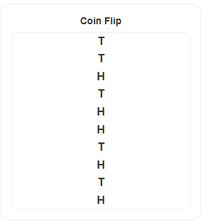](https://shiny.60land.com/week06/coinflipper/)

## Steps in Hypothesis Testing

1.  *What statistical story am I attempting to tell?*

<br>

2.  *What have I estimated or plotted to go along with that story, and what is my conclusion from those estimates alone?* *If there was no uncertainty in these estimates, what should the business do?*

<br>

3.  *Which test is appropriate and what is the null hypothesis?*

<br>

4.  *What is the statistical interpretation of the test result?*

<br>

5.  *What is the practical interpretation of this analysis for a business audience?*\
    *Are my estimates precise enough to tell the story I outlined in part (2)?*

## Steps in Hypothesis Testing

1.  [*What statistical story am I attempting to tell?*]{.muted}

<br>

2.  [*What have I estimated or plotted to go along with that story and what is my conclusion from those estimates alone? If there was no uncertainty in these estimates, what should the business do?*]{.muted}

<br>

3.  *Which test is appropriate and what is the null hypothesis?*

<br>

4.  *What is the statistical interpretation of the test result?*

<br>

5.  [*What is the practical interpretation of this analysis for a business audience?\
    Are my estimates precise enough to tell the story I outlined in part (2)?*]{.muted}

## “Dr.” Mike’s Old Timey Miracle\* Study Tonic {data-background-color="white" data-vertical-align="top" style="margin-bottom:0.25rem;"}

:::::::::::::::: {style="position: relative; height: 82vh; margin-top: -9rem;"}
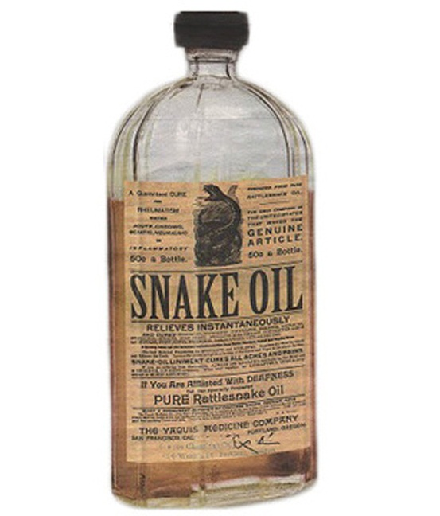{fig-alt="Vintage snake oil bottle" style="position:absolute; left:48%; top:48%; transform:translate(-50%,-50%) rotate(12deg); width:28%; height:auto;"}

::::: {style="position:absolute; left:6%; top:18%; max-width:34%; transform:rotate(-8deg);"}
::: {style="font-style:italic; font-weight:700; line-height:1.12; color:#2b2b2b; font-size:1.55rem;"}
“My insides hurt, my<br> outsides passed accounting!”
:::

::: {style="margin-top:0.35rem; font-style:italic; font-weight:650; color:rgba(0,0,0,0.35); font-size:1.05rem;"}
–actual student
:::
:::::

::::: {style="position:absolute; right:6%; top:20%; max-width:38%; transform:rotate(7deg);"}
::: {style="font-style:italic; font-weight:700; line-height:1.12; color:#2b2b2b; font-size:1.55rem;"}
“Studying has never been easier,<br> or burned my retinas so severely.”
:::

::: {style="margin-top:0.35rem; font-style:italic; font-weight:650; color:rgba(0,0,0,0.35); font-size:1.05rem;"}
–real student
:::
:::::

::::: {style="position:absolute; left:6%; bottom:16%; max-width:44%; transform:rotate(9deg);"}
::: {style="font-style:italic; font-weight:700; line-height:1.12; color:#2b2b2b; font-size:1.55rem;"}
“The searing pain motivated me to<br> improve my test score by up to 10 points.”
:::

::: {style="margin-top:0.35rem; font-style:italic; font-weight:650; color:rgba(0,0,0,0.35); font-size:1.05rem;"}
–a student
:::
:::::

::::: {style="position:absolute; right:5%; bottom:14%; max-width:46%; transform:rotate(-10deg);"}
::: {style="font-style:italic; font-weight:700; line-height:1.12; color:#2b2b2b; font-size:1.55rem;"}
“I blacked out for a few days, when I<br> regained consciousness my scantron<br> sheet was covered with ancient runes.<br> I got an AB!”
:::

::: {style="margin-top:0.35rem; font-style:italic; font-weight:650; color:rgba(0,0,0,0.35); font-size:1.05rem;"}
–student who wasn’t bribed
:::
:::::

::: {style="position:absolute; right:2%; bottom:5%; font-style:italic; font-size:1.15rem; color:rgba(0,0,0,0.45);"}
\*Now with 30% less Cesium 137
:::
::::::::::::::::

## What effect does it have on test scores?

::::: columns
::: {.column width="95%"}
```{r}

library(ggplot2)
library(dplyr)

plot_df <- ci_summary %>%
  mutate(
    study_label = paste("Study", study_index),
    study_f = factor(study_label, levels = rev(study_label))
  )

ggplot(plot_df, aes(y = study_f)) +

  # advertised improvement line
  geom_vline(xintercept = 10, linewidth = 1.1,
             color = "darkseagreen4", alpha = 0.7) +

  # mean dots only
  geom_point(aes(x = Mean),
             size = 5, color = "grey20") +

  coord_cartesian(xlim = c(-5, 30), clip = "off") +

  scale_x_continuous(
    breaks = c( 0, 10, 20),
    labels = function(x){
      ifelse(x == 0, "0",
             paste0(ifelse(x > 0, "+", ""), x, " pts."))
    }
  ) +

  labs(x = NULL, y = NULL) +

  theme_minimal(base_size = 16) +
  theme(
    plot.margin = margin(10, 20, 10, 60),
    panel.grid.major.y = element_blank(),
    panel.grid.minor = element_blank(),
    panel.grid.major.x = element_blank(),
    axis.text.y = element_text(hjust = 0, size = 14),  # left-justified
    axis.ticks.y = element_blank(),
    axis.text.x = element_text(size = 16)
  )

```
:::

::: {.column width="5%"}
{fig-alt="Vintage snake oil bottle" style="position:absolute; top:10%; transform:translate(-50%,-50%) rotate(12deg); width:12%; height:auto;"}
:::
:::::

## Sampling Distribution and Confidence Intervals

<br>

Statistics Review

<br>

[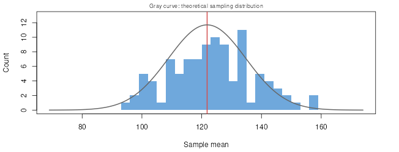](https://shiny.60land.com/week06/samplingdist/)

## What effect does it have on test scores?

::::: columns
::: {.column width="95%"}
```{r}
library(ggplot2)
library(dplyr)

plot_df <- ci_summary %>%
  mutate(
    study_label = paste("Study", study_index),
    study_f = factor(study_label, levels = rev(study_label))
  )

ggplot(plot_df, aes(y = study_f)) +
  # put the advertised line in the background
  geom_vline(xintercept = 10, linewidth = 1.1, color = "darkseagreen4", alpha = 0.7) +

  # CI lines (use height, not width)
  geom_errorbarh(
    aes(xmin = lower_bound, xmax = upper_bound),
    height = 0.18, linewidth = 1.2, color = "grey20"
  ) +

  # mean dots
  geom_point(aes(x = Mean), size = 5, color = "grey20") +

  # DON'T clip CIs: use coord_cartesian instead of limits=
  coord_cartesian(xlim = c(-20, 35), clip = "off") +

  scale_x_continuous(
    breaks = c(-10, 0, 10, 20, 30),
    labels = function(x){
      ifelse(x == 0, "0",
             paste0(ifelse(x > 0, "+", ""), x, " pts."))
    }
  ) +
  labs(x = NULL, y = NULL) +
  theme_minimal(base_size = 16) +
  theme(
    plot.margin = margin(10, 20, 10, 60),
    panel.grid.major.y = element_blank(),
    panel.grid.minor = element_blank(),
    panel.grid.major.x = element_blank(),
    axis.text.y = element_blank(),
    axis.ticks.y = element_blank(),
    axis.text.x = element_text(size = 16)
  )
```
:::

::: {.column width="5%"}
{fig-alt="Vintage snake oil bottle" style="position:absolute; top:10%; transform:translate(-50%,-50%) rotate(12deg); width:12%; height:auto;"}
:::
:::::

## Confidence Intervals

Intervals that contain the ‘true’ population value of the parameter in 95% of samples.

<br>

::: {.fragment .strike style="color:#b30000; text-decoration-thickness:3px;"}
I’m 95% confident that the population value falls in this interval.
:::

<br>

::: {.fragment .strike style="color:#b30000; text-decoration-thickness:3px;"}
An interval where there is a 95% probability that it contains the population value.
:::

<br><br>

::: fragment
**Probability of containing the population value is 0 or 1 but you can’t know which.**
:::

::::: {.columns style="margin-top: 1.2rem;"}
::: {.column width="40%"}
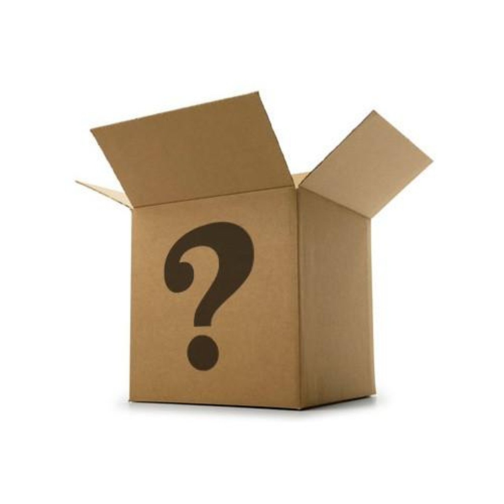{width="70%" fig-alt="Mystery box icon representing unknown truth."}
:::

::: {.column width="60%"}
<br> <br> <br> {width="80%" fig-alt="Generic confidence interval graphic with a point estimate and horizontal interval."}
:::
:::::

# Which test is appropriate and what is the null hypothesis?

## [Writing a Null Hypothesis]{.sr-only}

### *Which test is appropriate and what is the null hypothesis?*

<br>

::::: {style="margin-bottom:3.5rem;"}
::: {style="font-size:1.5rem; font-weight:600;"}
Report Hypothesis
:::

::: {style="font-size:2.3rem; font-weight:700; margin-top:0.4rem;"}
Students who use study tonic will increase their test scores by 10 points on average.
:::
:::::

::::: {style="margin-bottom:3.5rem;"}
::: {style="font-size:1.5rem; font-weight:600;"}
Null Hypothesis
:::

::: {style="font-size:2.3rem; font-weight:700; margin-top:0.4rem;"}
H<sub>0</sub>: $\mu$ <sub>change_score</sub> = 0
:::
:::::

<div>

::: {style="font-size:1.5rem; font-weight:600;"}
Alternate Hypothesis
:::

::: {style="font-size:2.3rem; font-weight:700; margin-top:0.4rem;"}
H<sub>A</sub>: $\mu$ <sub>change_score</sub> $\neq$ 0
:::

</div>

## [Choosing and appropriate test]{.sr-only}

### *Which test is appropriate and what is the null hypothesis?*

::::: columns
::: {.column width="55%"}
*Statistical Test*

**Chi-Square Goodness of Fit** `csf()`

**Chi-Square Test of Independence** `csi()`

<br>

**Paired Samples t Test** `pst()`

**Wilcoxon Signed-Rank Test** `psw()`

**Independent Samples t Test** `idt()`

**Wilcoxon Rank-Sum Test** `idw()`

**One Sample t Test** `ost()`

<br>

**AN**alysis **O**f **VA**riance `ano()`

**Simple Linear Regression** `slr()`
:::

::: {.column width="45%"}
*Null Hypothesis*

H<sub>0</sub>: Variable<sub>1</sub> fits expected model\
H<sub>0</sub>: Variable<sub>1</sub> is not associated with Variable<sub>2</sub>

<br><br>

H<sub>0</sub>: μGroup<sub>1</sub> = μGroup<sub>2</sub>

<br><br>

H<sub>0</sub>: μVariable = value

<br>

H<sub>0</sub>: μGroup<sub>1</sub> = μGroup<sub>2</sub> = μGroup<sub>3</sub>

H<sub>0</sub>: β<sub>1</sub> = 0
:::
:::::

## [What to do with a Null Hypothesis]{.sr-only}

:::::::::: center
::: {style="font-size:2.1rem; font-weight:600; color:#3b3b3b; margin-top:1.5rem;"}
All tests take action on H<sub>0</sub>
:::

::: {style="height:3.0rem;"}
:::

::: {style="font-size:2.4rem; font-weight:600; color:#2e8b2e;"}
Reject H<sub>0</sub>
:::

::: {style="height:2.0rem;"}
:::

::: {style="font-size:2.4rem; font-weight:600; color:#ff3b1f;"}
Fail to Reject H<sub>0</sub>
:::

::: {style="height:7.0rem;"}
:::

::: {style="font-size:2.4rem; font-weight:600; color:#111;"}
Meant to minimize type 1 error
:::
::::::::::

## Type I vs Type II Errors

:::::::::::::: columns
::::::::::: {.column width="55%"}
<br>

:::::: {style="margin-top:1rem;"}
::: {style="font-size:1.8rem; font-weight:500;"}
Type 1 error
:::

::: {style="font-size:1.5rem; color:#777; margin-top:0.5rem;"}
Rejecting a true null hypothesis
:::

::: {style="font-size:1.8rem; font-weight:600; color:#ff3b1f; margin-top:0.8rem;"}
Killing the innocent
:::
::::::

<br><br>

<div>

::: {style="font-size:1.8rem; font-weight:500;"}
Type 2 error
:::

::: {style="font-size:1.5rem; color:#777; margin-top:0.5rem;"}
Fail to reject a false null hypothesis
:::

::: {style="font-size:1.8rem; font-weight:600; color:#ff3b1f; margin-top:0.8rem;"}
Letting the guilty go free
:::

</div>
:::::::::::

:::: {.column width="45%"}
<br><br><br>

::: {style="text-align:right;"}
{width="55%" fig-alt="Judge's gavel representing legal analogy for hypothesis testing errors."}
:::
::::
::::::::::::::

## Type I vs Type II Errors

::::::::::::::::: {style="position:relative; height:80vh;"}
<!-- Left image (false positive) -->

::: {style="position:absolute; left:1%; top:6%; width:46%; z-index:1;"}
{width="75%" fig-alt="Nurse giving a shot to a child; example of a false positive."}
:::

<!-- Left interrobang -->

::: {style="position:absolute; left:8%; top:3%; z-index:5;             font-size:3.2rem; font-weight:700; color:#c00000; transform:rotate(-15deg);"}
?!
:::

<!-- Left speech bubble -->

::: {style="position:absolute; left:32%; top:7.5%; z-index:6;             background:white; border:3px solid #2f66d0; border-radius:18px;             padding:0.75rem 1.05rem; font-size:1.55rem; font-weight:700;             line-height:1.15; text-align:center;"}
You’re<br>Pregnant!
:::

<!-- Bubble tail (approx) -->

::: {style="position:absolute; left:30.9%; top:15.8%; z-index:6;             width:22px; height:22px; background:white;             border-left:3px solid #2f66d0; border-bottom:3px solid #2f66d0;             transform:rotate(45deg);"}
:::

<!-- Left labels -->

::::: {style="position:absolute; left:11%; top:53%; z-index:7; text-align:center;"}
::: {style="font-size:2.1rem; font-weight:600; color:#333;"}
Type 1 error
:::

::: {style="font-size:2.0rem; font-weight:600; color:#8a8a8a;"}
False Positive
:::
:::::

<!-- Right image (false negative) -->

::: {style="position:absolute; left:52%; top:38%; width:46%; z-index:1;"}
{width="115%" fig-alt="Doctor telling a pregnant person they are not pregnant; example of a false negative."}
:::

<!-- Right interrobang -->

::: {style="position:absolute; left:93%; top:42%; z-index:5;             font-size:3.2rem; font-weight:700; color:#c00000; transform:rotate(18deg);"}
?!
:::

<!-- Right speech bubble -->

::: {style="position:absolute; left:51%; top:38%; z-index:6;             background:white; border:3px solid #2f66d0; border-radius:18px;             padding:0.75rem 1.05rem; font-size:1.55rem; font-weight:700;             line-height:1.15; text-align:center;"}
You’re Not<br>Pregnant!
:::

<!-- Bubble tail (approx) -->

::: {style="position:absolute; left:65.5%; top:45%; z-index:6;             width:22px; height:22px; background:white;             border-left:3px solid #2f66d0; border-bottom:3px solid #2f66d0;             transform:rotate(-135deg);"}
:::

<!-- Right labels -->

::::: {style="position:absolute; left:70%; top:28%; z-index:7; text-align:center;"}
::: {style="font-size:2.1rem; font-weight:600; color:#333;"}
Type 2 error
:::

::: {style="font-size:2.0rem; font-weight:600; color:#8a8a8a;"}
False Negative
:::
:::::
:::::::::::::::::

# Experiment

## [Choosing and appropriate test]{.sr-only}

### *Which test is appropriate and what is the null hypothesis?*

<br>

::::::::::::::::: columns
:::::::::::: {.column width="62%"}
::::: {style="margin-bottom:3.5rem;"}
::: {style="font-size:1.5rem; font-weight:600;"}
Report Hypothesis
:::

::: {style="font-size:2.3rem; font-weight:700; margin-top:0.4rem;"}
Participants who have practiced will be able to solve a cube.
:::
:::::

::::: {style="margin-bottom:3.5rem;"}
::: {style="font-size:1.5rem; font-weight:600;"}
Null Hypothesis
:::

::: {style="font-size:2.3rem; font-weight:700; margin-top:0.4rem;"}
H<sub>0</sub>: Participant did not practice
:::
:::::

<div>

::: {style="font-size:1.5rem; font-weight:600;"}
Alternate Hypothesis
:::

::: {style="font-size:2.3rem; font-weight:700; margin-top:0.4rem;"}
H<sub>A</sub>: Participant practiced
:::

</div>
::::::::::::

:::::: {.column width="38%"}
::::: {style="position: relative; height: 70vh;"}
<!-- Unsolved cube: align with Null Hypothesis -->

::: {style="position:absolute; left:50%; top:32%; transform:translateX(-50%);"}
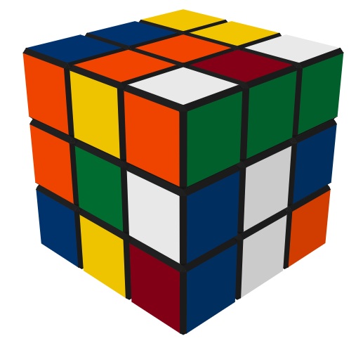{width="80%" fig-alt="Unsolved Rubik's cube."}
:::

<!-- Solved cube: align with Alternate Hypothesis -->

::: {style="position:absolute; left:50%; top:61%; transform:translateX(-50%);"}
{width="80%" fig-alt="Solved Rubik's cube."}
:::
:::::
::::::
:::::::::::::::::

## Confusion Matrix

:::::::::::: {style="position: relative; height: 85vh;"}
<!-- Vertical Divider -->

::: {style="position:absolute; left:50%; top:0; bottom:0; width:2px; background:#777;"}
:::

<!-- LEFT SIDE (PASS) -->

:::::: {style="position:absolute; left:0; width:50%; text-align:center;"}
::: {style="font-size:2.2rem; font-weight:700; color:#4b7f2a; margin-top:1rem;"}
Pass
:::

::: {style="margin-top:1.5rem;"}
{width="38%" fig-alt="Solved Rubik's cube."}
:::

::: {style="margin-top:3rem;"}
+-------------------+----------------+
| H~0~: No Practice | H~A~: Practice |
+===================+================+
| **Type 1 Error**\ | **No Error**\  |
| False Positive    | True Positive  |
+-------------------+----------------+
:::
::::::

<!-- RIGHT SIDE (FAIL) -->

:::::: {style="position:absolute; right:0; width:50%; text-align:center;"}
::: {style="font-size:2.2rem; font-weight:700; color:#b30000; margin-top:1rem;"}
Fail
:::

::: {style="margin-top:1.5rem;"}
{width="38%" fig-alt="Unsolved Rubik's cube."}
:::

::: {style="margin-top:3rem;"}
+-------------------+-------------------+
| H~0~: No Practice | H~A~: Practice    |
+===================+===================+
| **No Error**\     | **Type 2 Error**\ |
| True Negative     | False Negative    |
+-------------------+-------------------+
:::
::::::
::::::::::::

## Setting α (Alpha)

::: {style="font-size:2rem; font-weight:600; margin-top:1.5rem;"}
α = How much false alarm risk are we willing to accept?
:::

<br>

::: {style="font-size:1.6rem; margin-top:1rem;"}
• High α = 0.95 → we call lots of things “impressive”\
• Low α = 0.0001 → almost nothing counts as impressive
:::

<br><br>

::: {style="font-size:1.8rem; font-weight:700;"}
Common choice: α = 0.05
:::

::: {style="margin-top:0.5rem; font-size:1.4rem; color:#666;"}
(We accept at most a 5% chance of falsely rejecting H<sub>0</sub>)
:::

## Easy Test Condition

(High α → Lots of False Positives, Random Success Isn't Rare)

::: {style="display:flex; justify-content:space-between; margin-top:2rem;"}
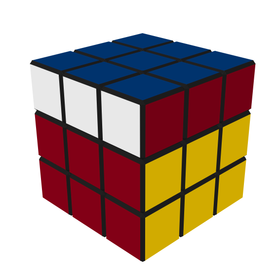{width="17%"} 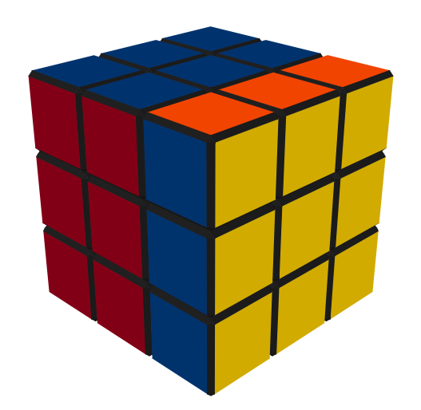{width="17%"} 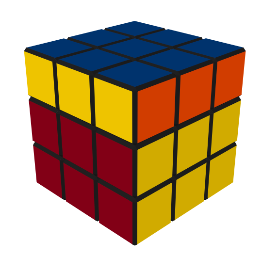{width="17%"} 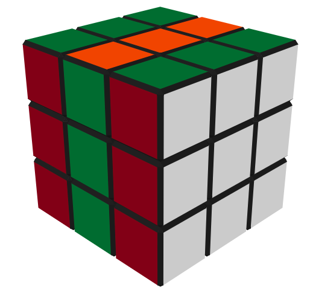{width="17%"} 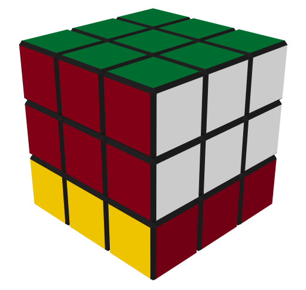{width="17%"}
:::

::: {style="font-size:2rem; text-align:center; font-weight:600;"}
Does this support H<sub>0</sub> or H<sub>A</sub>?
:::

::: {style="display:flex; justify-content:space-between;"}
{width="17%"} {width="17%"} {width="17%"} {width="17%"} {width="17%"}
:::

## Hard Test Condition

(α ≈ 0.05 → False Positives and Random Success Should be Rare)

::: {style="display:flex; justify-content:space-between; margin-top:2rem;"}
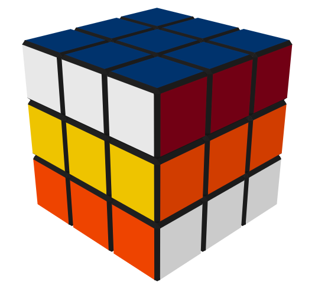{width="17%"} 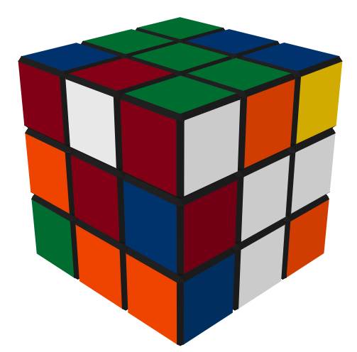{width="17%"} 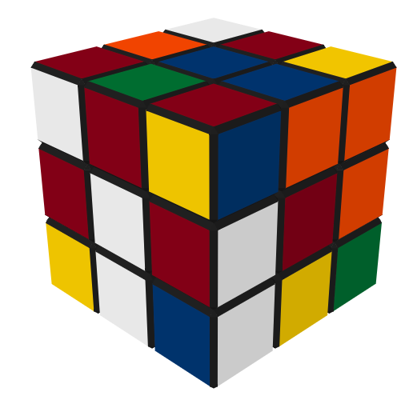{width="17%"} 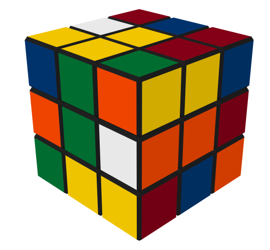{width="17%"} 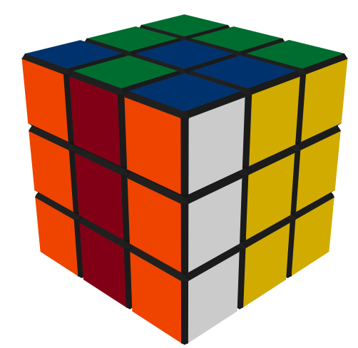{width="17%"}
:::

::: {style="font-size:2rem; text-align:center; font-weight:600;"}
Does this support H<sub>0</sub> or H<sub>A</sub>?
:::

::: {style="display:flex; justify-content:space-between; margin-top:2rem;"}
{width="17%"} {width="17%"} {width="17%"} {width="17%"} {width="17%"}
:::

## Hard Test Condition

(α ≈ 0.05 → Random Success Should be Rare, False Negative are Possible)

::: {style="display:flex; justify-content:space-between; margin-top:2rem;"}
{width="17%"} {width="17%"} {width="17%"} {width="17%"} {width="17%"}
:::

::: {style="font-size:2rem; text-align:center; font-weight:600;"}
Does this support H<sub>0</sub> or H<sub>A</sub>?
:::

::: {style="display:flex; justify-content:space-between; margin-top:2rem;"}
{width="17%"} {width="17%"} {width="17%"} {width="17%"} {width="17%"}
:::

## α and p-value

<br>

::: {style="margin-top:0.4rem; font-size:1.4rem; color:#666;"}
α = 0.05 We accept up to a 5% false alarm rate <em>in the long run</em>.
:::

<hr>

::: {style="font-size:2rem; font-weight:600; margin-top:0.8rem;"}
<strong>p-value</strong> = an objective measure of how surprising our result is <em>if H<sub>0</sub> were true</em>
:::

::: {style="margin-top:0.6rem; font-size:1.55rem; color:#666;"}
Think: “How rare would this outcome be in the H<sub>0</sub> world?”
:::

<br>

::: {style="font-size:1.95rem; font-weight:800;"}
Decision rule:
:::

::: {style="font-size:1.8rem; margin-top:0.4rem;"}
• If <strong>p ≤ α</strong> → [Reject H<sub>0</sub>]{style="color:#2e8b2e; font-weight:600;"} (go with H<sub>A</sub>)\
• If <strong>p \> α</strong> → [Fail to reject H<sub>0</sub>]{style="color:#c00000; font-weight:600;"}
:::

## α and p-value

<br>

::::::: columns
:::: {.column width="50%"}
### α (alpha)

<br>

::: fragment
**Design choice**

Chosen *before* we see the data

Controls long-run Type I error rate

“How skeptical are we going to be?”

α is a *policy*
:::
::::

:::: {.column width="50%"}
### p-value

<br>

::: fragment
**Data result**

Computed *after* we see the data

Measures how surprising the data are if H<sub>0</sub> were true

“How lucky would we have to be?”

p is an *observation*.
:::
::::
:::::::

# What is the statistical interpretation of the test result?

## [p value Interpretation]{.sr-only}

### What is the statistical interpretation of the test result?

<br>

::: {style="font-size:2rem; font-weight:700;"}
Reject H<sub>0</sub>\
[p value is less than α]{style="color:#4e7d3a; font-weight:700;"}
:::

::: {style="font-size:1.6rem; color:#777; margin-top:0.8rem;"}
Sufficient evidence in the data to support H<sub>A</sub>
:::

<br><br>

::: {style="font-size:2rem; font-weight:700;"}
Fail to reject H<sub>0</sub>\
[p value is not less than α]{style="color:#4e7d3a; font-weight:700;"}
:::

::: {style="font-size:1.6rem; color:#777; margin-top:0.8rem;"}
Insufficient evidence in the data to support H<sub>A</sub>
:::

<br><br>

::: {style="font-size:2.4rem; font-weight:700; color:#c00000;"}
You can’t prove anything with statistics
:::

## [How to talk about significant results]{.sr-only}

### What is the statistical interpretation of the test result?

<br>

:::::::: columns
::::: {.column width="45%"}
### Naughty Words

::: {style="color:#cc0000; font-weight:700; font-size:1.8rem; line-height:1.8;"}
Prove\
Definitely\
Causes
:::

<br>

### Nice Words

::: {style="color:#2ca02c; font-weight:700; font-size:1.8rem; line-height:1.8;"}
Related\
Supports\
Likely
:::
:::::

:::: {.column width="55%"}
<br> <br>

::: {style="text-align:center;"}
{width="90%" fig-alt="XKCD comic about correlation and causation."}
:::
::::
::::::::

## p Value

The probability of getting a test statistic at least as extreme as the one you observed\
**given that H**<sub>0</sub> is true.

<br>

::: {.fragment .strike style="color:#b30000; text-decoration-thickness:3px;"}
The probability of a chance result.
:::

::: {.fragment .strike style="color:#b30000; text-decoration-thickness:3px;"}
The probability that H<sub>A</sub> is true.
:::

::: {.fragment .strike style="color:#b30000; text-decoration-thickness:3px;"}
The probability that H<sub>0</sub> is true.
:::

<br>

::: fragment
**The Type I error in this study is 0 or 1 we can't know which.**
:::

<br>

:::::: columns
::: {.column width="40%"}
{width="60%"}
:::

:::: {.column width="60%"}
::: {style="font-size:2.4rem; font-weight:700; text-align:center; margin-top:1rem;"}
p = 0.027
:::
::::
::::::

## Steps in Hypothesis Testing

```{r setup_t echo:FALSE, include:FALSE}

df <- df %>%
  filter(study_index == 1)

h1 <- df %>%
  ost(~change_score, mu= 0)

```

1.  *Students who use study tonic will increase their test scores by 10 points on average.*

2.  *The data shows a 12.5pt increase - Tables, Descriptives, Charts,*

3.  *One Sample t-test*

H<sub>0</sub>: $\mu$ <sub>change_score</sub> = 0

H<sub>A</sub>: $\mu$ <sub>change_score</sub> $\neq$ 0

$\alpha$ = 0.05

::: fragment
```{r show_t, echo=TRUE, results="hide", message=FALSE, warning=FALSE}
df %>%
  ost(~change_score, mu= 0)
```
:::

4.  *What is the statistical interpretation of the test result?*

::: fragment
`r h1$results`
:::

5.  *What is the practical interpretation of this analysis for a business audience?*\
    *Are my estimates precise enough to tell the story I outlined in part (2)?*

## What effect does it have on test scores?

::::: columns
::: {.column width="95%"}
```{r}
library(ggplot2)
library(dplyr)

plot_df <- ci_summary %>%
  mutate(
    study_f = factor(study_index, levels = rev(study_index)),
    p_label = paste0("p = ", sprintf("%.3f", p))
  )

ggplot(plot_df, aes(y = study_f)) +

  # Red reference line at 0 (null effect)
  geom_vline(xintercept = 0, linewidth = 1.2,
             color = "red3", alpha = 0.8) +

  # Confidence intervals
  geom_errorbarh(
    aes(xmin = lower_bound, xmax = upper_bound),
    height = 0.18, linewidth = 1.2, color = "grey20"
  ) +

  # Mean points
  geom_point(aes(x = Mean),
             size = 5, color = "grey20") +

  # Left-side p-value labels
  geom_text(
    aes(x = -30
        , label = p_label),
    hjust = 0, size = 5,
    color = "red3", fontface = "italic"
  ) +

  coord_cartesian(xlim = c(-20, 35), clip = "off") +

  scale_x_continuous(
    breaks = c(-20, -10, 0, 10, 20, 30),
    labels = function(x){
      ifelse(x == 0, "0",
             paste0(ifelse(x > 0, "+", ""), x, " pts."))
    }
  ) +

  labs(x = NULL, y = NULL) +

  theme_minimal(base_size = 16) +
  theme(
    plot.margin = margin(10, 20, 10, 80),
    panel.grid.major.y = element_blank(),
    panel.grid.minor = element_blank(),
    panel.grid.major.x = element_blank(),
    axis.text.y = element_blank(),
    axis.ticks.y = element_blank(),
    axis.text.x = element_text(size = 16)
  )
```
:::

::: {.column width="5%"}
{fig-alt="Vintage snake oil bottle" style="position:absolute; top:10%; transform:translate(-50%,-50%) rotate(12deg); width:12%; height:auto;"}
:::
:::::

## [Hypothesis Test Interpretation]{.sr-only}

### What is the practical interpretation for a business audience? Are my estimates precise enough to tell the story outlined in part (2)?

<br>

### Statistical Significance

-   *There is a statistically significant difference between these two groups.*

-   *If we say these two groups are different, we will be right 95% of the time (in the long run).*

-   *There is a difference between these two groups and it is most likely not happening by chance.*

<br>

::: {style="text-align:center; margin-top:1.2rem;"}
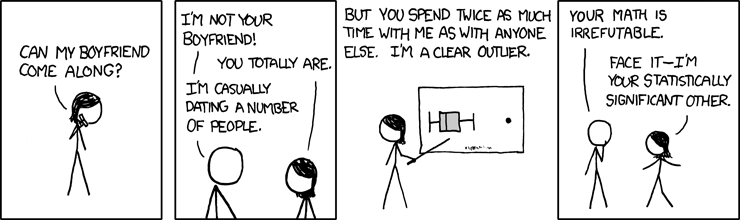{width="70%" fig-alt="XKCD comic about statistical significance."}
:::

## p Value

<br>

Tells us nothing about importance because p depends on sample size

Provides little evidence about the null hypothesis

Encourages all-or-nothing thinking

Based on long-run probabilities

p is the relative frequency of our observed test statistic relative to all test statistics from an infinite number of experiments.

<br>

::::: columns
::: {.column width="40%"}
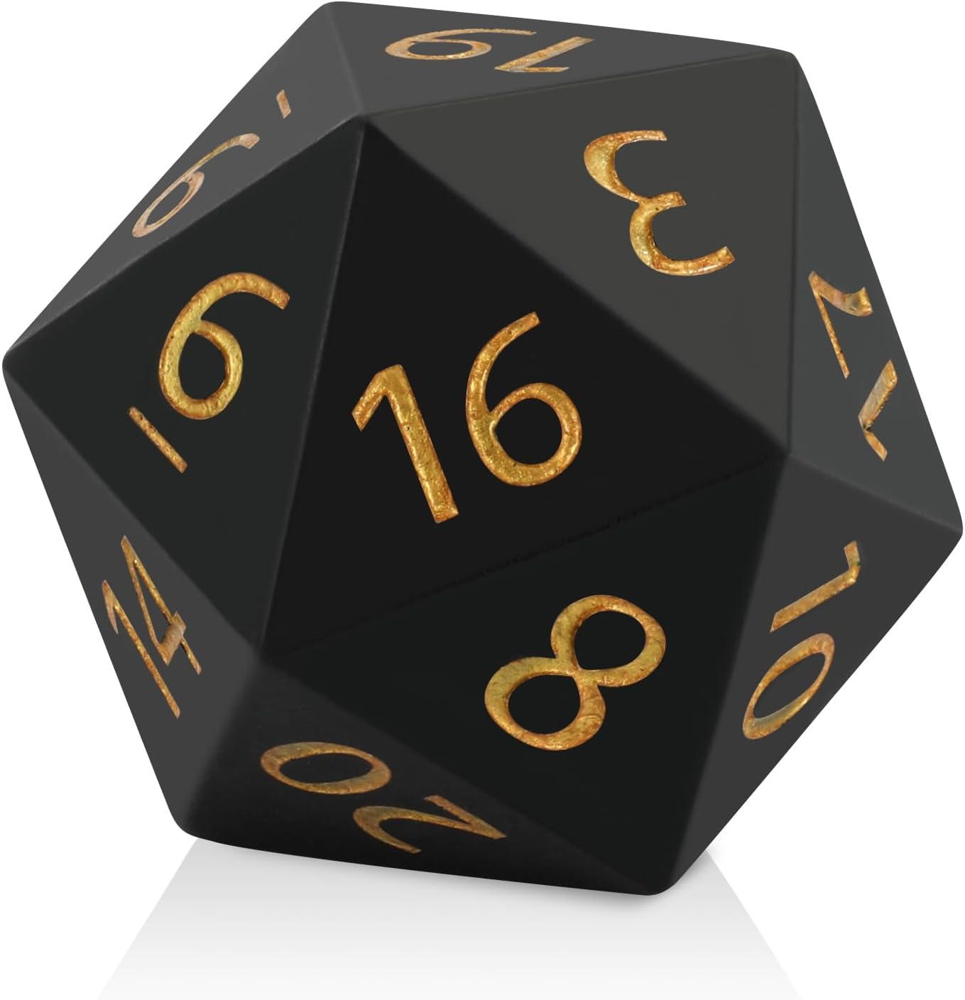{width="55%" fig-alt="Twenty-sided die representing randomness under the null hypothesis."}
:::

::: {.column width="60%"}
:::
:::::

## p Value hacking

::::: columns
::: {.column width="95%"}
```{r}
library(ggplot2)
library(dplyr)

plot_df <- n_summary %>%
  arrange(N) %>%   # smallest to largest
  mutate(
    study_f = factor(paste0("n = ", N), levels = paste0("n = ", N)),
    n_label = paste0("n = ", N),
    p_label = paste0("p = ", sprintf("%.3f", p))
  )

ggplot(plot_df, aes(y = study_f)) +

  # Red null line
  geom_vline(xintercept = 0, linewidth = 1.2,
             color = "red3", alpha = 0.8) +

  # CIs
  geom_errorbarh(
    aes(xmin = lower_bound, xmax = upper_bound),
    height = 0.18, linewidth = 1.2, color = "grey20"
  ) +

  # Means
  geom_point(aes(x = Mean),
             size = 5, color = "grey20") +

  # n labels (further left)
  geom_text(
    aes(x = -35, label = n_label),
    hjust = 0,
    size = 5,
    color = "grey30"
  ) +

  # p labels (closer to n)
  geom_text(
    aes(x = -29, label = p_label),
    hjust = 1,
    size = 5,
    color = "red3",
    fontface = "italic"
  ) +

  coord_cartesian(xlim = c(-40, 40), clip = "off") +

  scale_x_continuous(
    breaks = c(-20, -10, 0, 10, 20, 30, 40),
    labels = function(x){
      ifelse(x == 0, "0",
             paste0(ifelse(x > 0, "+", ""), x, " pts."))
    }
  ) +

  labs(x = NULL, y = NULL) +

  theme_minimal(base_size = 16) +
  theme(
    plot.margin = margin(10, 20, 10, 130),
    panel.grid.major.y = element_blank(),
    panel.grid.minor = element_blank(),
    panel.grid.major.x = element_blank(),
    axis.text.y = element_blank(),   # remove duplicated labels
    axis.ticks.y = element_blank(),
    axis.text.x = element_text(size = 16)
  )
```
:::

::: {.column width="5%"}
{fig-alt="Vintage snake oil bottle" style="position:absolute; top:10%; transform:translate(-50%,-50%) rotate(12deg); width:12%; height:auto;"}
:::
:::::

## Steps in Hypothesis Testing

1.  *What statistical story am I attempting to tell?*

<br>

2.  *What have I estimated or plotted to go along with that story, and what is my conclusion from those estimates alone?* *If there was no uncertainty in these estimates, what should the business do?*

<br>

3.  *Which test is appropriate and what is the null hypothesis?*

<br>

4.  *What is the statistical interpretation of the test result?*

<br>

5.  *What is the practical interpretation of this analysis for a business audience?*\
    *Are my estimates precise enough to tell the story I outlined in part (2)?*
