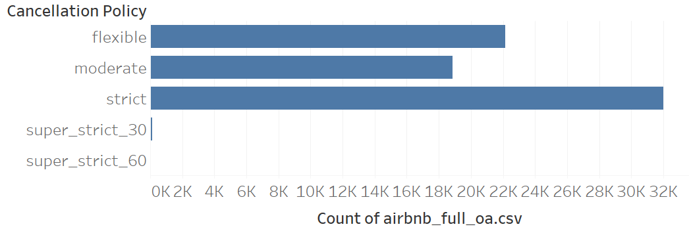
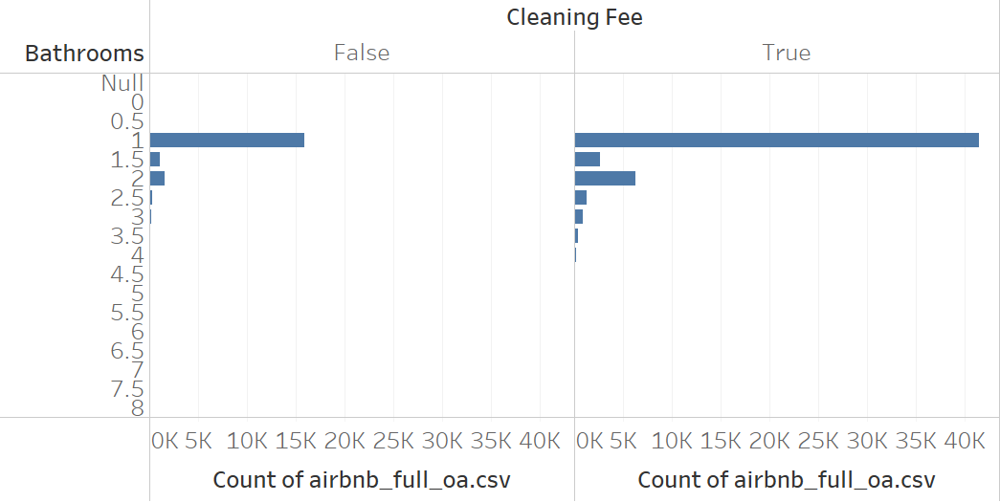

```{r}
#| include: false
library(tidyverse)
library(tidyr)
library(eco230r)
library(ggplot2)
library(knitr)
library(Hmisc)
```

## HOMEWORK 6: CHI SQUARED ANALYSIS

::: {.callout-note title="Objectives"}
- Complete step 4 of the hypothesis testing process: What is the statistical interpretation of the test result?
- Complete step 5 of the hypothesis testing process: What is the practical interpretation of this analysis for a business audience?
- Attempt to run a Chi Squared test in R and complete steps 1–5
:::

::: {.callout-note title="Resources"}
- `.csv` files included with this project or your groups clean data set
- Week 6 & 7 resources and lectures
:::

::: {.callout-important title="Instructions"}
1. Load the dataset into R as `df`

```{r}
df <- read.csv('../shared/data/airbnb_chicago.csv')
```

2. Review the example in Hypothesis 1  
3. Complete steps 4–5 of the Hypothesis Test for Hypothesis 2  
4. Attempt to run chi squared analysis in R related to your project and complete steps 1–5
:::

---

### Hypothesis 1 - Full Example

1. **What statistical story am I attempting to tell?**

It is more likely for a property to have a strict cancellation_policy than any other cancellation_policy.

2. **What have I estimated or plotted to go along with that story and what is my conclusion from those estimates alone?**



Note: There are very few records in the super strict policies so we will have to filter them out.

3. **Which test is appropriate and what is the null hypothesis?**

Test Type: Chi Squared ($X^2$) Goodness of Fit Test `csf()`

$H_0$: Cancellation_policy fits the Expected Model (default all categories equal)

$H_A$: Cancellation_policy does not fit the Expected Model (default all categories equal)

$\alpha = 0.05$

```{r}
h1 <- df %>%
  filter(cancellation_policy %in% c('flexible','moderate','strict')) %>%
  csf(~cancellation_policy)

print(h1)
```

4. **Statistical Interpretation**

`r h1$results`

p is less than 0.05 so we reject the null hypothesis. Cancellation_policy does not fit the expected model.

5. **Practical Interpretation**

Standardized residuals over 2 represent statistical significance so this effect is most likely not happening by chance.

Airbnb properties are much more likely to have a strict cancellation policy, likely to ensure operators generate income even if customers cancel reservations.

If you wanted to make your property stand out you might pick a moderate or flexible cancellation policy as they appear less common. However this comes with risk because cancellations become more likely.

Standardized residuals:

`r knitr::kable(h1$standardized_residuals)`

Cohen's w indicates a small effect size so the overall effect of this relationship may be small. Strict policies appeared more often than expected, but the difference is not extremely high relative to the full distribution of cancellation policies. On the other hand, Bayes factor is extremely large indicating decisive evidence for the explanation that owners are much more likely to have a strict cancellation policy, it indicates that the decision is not random. This is likely representing a rather important real world effect, the increased risk of last minute cancellations may explain why those types of policies are used less freqently.

---

### Hypothesis 2 - Interpret Steps 4–5

1. **Statistical Story**

Number of bathrooms is associated with whether or not there is a cleaning fee.

2. **Estimates / Plot**



Note: There are very few records with fewer than 1 bathroom or more than 2 bathrooms so we filter those.

3. **Test and Hypothesis**

Test Type: Chi Squared ($X^2$) Test of Independence `csi()`

$H_0$: cleaning_fee is not associated with bathrooms

$H_A$: cleaning_fee is associated with bathrooms

```{r}
h2 <- df %>%
  filter(bathrooms >= 1 & bathrooms <= 2) %>%
  csi(cleaning_fee~bathrooms)

print(h2)
```

4. **Statistical Interpretation**

`r h2$results`

Statistical Interpretation:

5. **Practical Interpretation**

Practical Interpretation:

Hint: look at standardized residuals and effect sizes

`r knitr::kable(h2$standardized_residuals)`

---

### Hypothesis 3 - Your Full Test

1. **What statistical story am I attempting to tell?**

Hypothesis:

2. **What have I estimated or plotted?**

You may leave blank or include a plot.

3. **Which test is appropriate and what is the null hypothesis?**

Test Type:

$H_0$:

$H_A$:

$\alpha = 0.05$

```{r}
#Attempt a test using csf() or csi()

ff <- read.csv('../shared/data/airbnb_chicago.csv')

#h3 <- ff %>%
#  csi(cleaning_fee~bathrooms)

#print(h3)
```

4. **Statistical Interpretation**

Statistical Interpretation:

5. **Practical Interpretation**

Practical Interpretation: