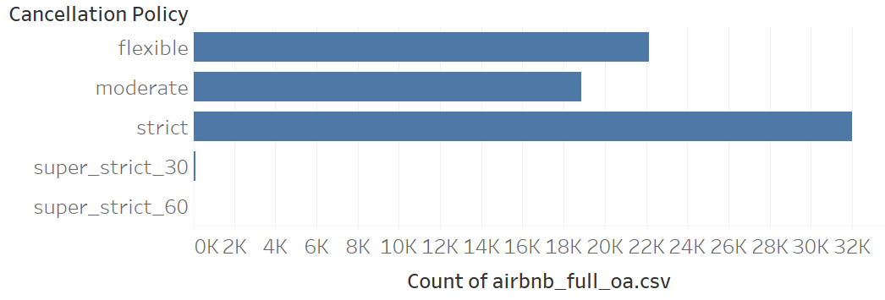
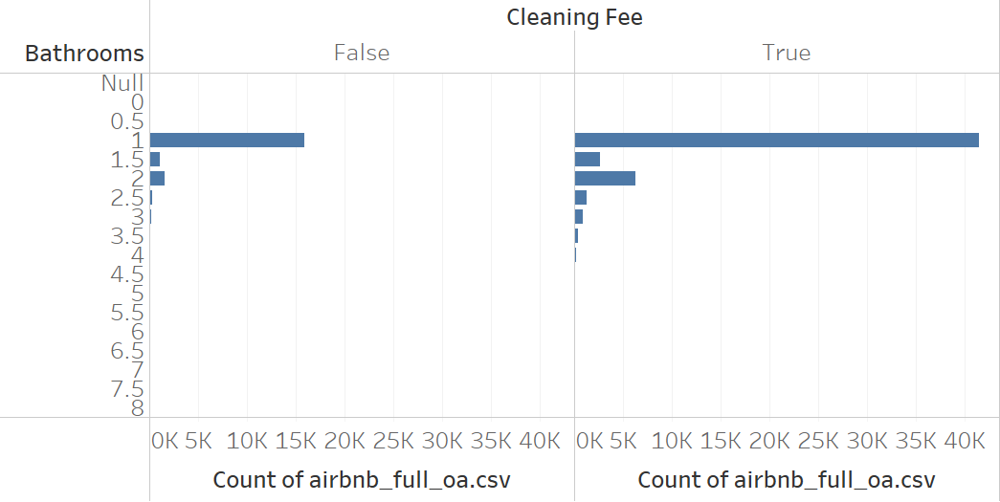

```{r}
#| include: false
library(tidyverse)
library(eco230r)
```

::: {.callout-note appearance="minimal" icon="false" title="Purpose"}
This assignment helps you move from selecting a hypothesis test to interpreting
the evidence it produces.

You will review a worked chi-square example, complete two interpretations, and
attempt a chi-square analysis connected to your project dataset.
:::

## Objectives

By the end of this assignment, you will be able to:

- distinguish a chi-square goodness-of-fit test from a chi-square test of
  independence;
- interpret a p-value in relation to a stated null hypothesis;
- use standardized residuals and available evidence measures to assess
  practical importance; and
- complete the five-step hypothesis-testing process for a project-related
  question.

## Resources

- Week 6 and Week 7 slides and interpretation resources
- The four `.csv` files in the `data` folder
- The `csf()` and `csi()` functions from `eco230r`
- Your project story and candidate hypotheses

::: {.callout-tip appearance="minimal" icon="false" title="Expectations"}
This assignment is graded for a sincere analytical attempt, correct use of the
five-step process, and interpretations that refer to the variables and evidence
in context. Your project-related code may be incomplete, but it must show the
test you attempted and any changes you made.
:::

## 1) Review the Worked Example

The Airbnb dataset is used for the first two hypotheses. Do not change this
setup code.

```{r}
df <- read.csv(file.path("data", "airbnb_chicago.csv"))
```

### Hypothesis 1 - Worked Example

1. **Statistical story:** What relationship, difference, or pattern are you
   investigating, and why might it matter?

   Airbnb properties are more likely to use a strict cancellation policy than
   either a flexible or moderate cancellation policy. This may matter to an
   operator deciding how to balance booking risk with customer flexibility.

2. **Estimate or plot:** What does the descriptive evidence suggest? If there
   were no uncertainty, what action would the business take?

   {fig-alt="A horizontal bar chart showing that strict cancellation policies are more common than flexible or moderate policies."}

   The super-strict categories contain very few records, so the analysis below
   filters them out. Among the remaining categories, strict policies appear most
   often.

3. **Test and hypotheses:** Which test is appropriate? State $H_0$, $H_A$,
   and the alpha level.

   Test: chi-square goodness-of-fit test using `csf()`

   $H_0$: Cancellation policy follows the expected model in which flexible,
   moderate, and strict policies occur equally often.

   $H_A$: Cancellation policy does not follow the expected model.

   $\alpha = 0.05$

```{r}
#| output: false
h1 <- df |>
  filter(cancellation_policy %in% c("flexible", "moderate", "strict")) |>
  csf(~ cancellation_policy)

print(h1)
```

4. **Statistical interpretation:** What does the result say about the evidence
   against $H_0$? Report the relevant estimate and uncertainty in context.

   `r h1$results`

   Because the p-value is below 0.05, reject $H_0$. The observed cancellation
   policies do not fit an equal-proportions model.

5. **Practical interpretation:** How large and consequential is the result for
   a general business audience?

   The standardized residuals show which categories contribute most to the
   difference between the observed and expected counts.

```{r}
#| echo: false
knitr::kable(h1$standardized_residuals)
```

   Strict policies appear more often than expected, while flexible and moderate
   policies appear less often than expected. An operator could use a more
   flexible policy to differentiate a listing, but that decision should also
   account for the financial risk of cancellations. If the test output provides
   an effect size or Bayes factor, use it to qualify the magnitude and strength
   of this conclusion.

---

## 2) Complete the Statistical and Practical Interpretations

### Hypothesis 2 - Complete Steps 4-5

1. **Statistical story:** What relationship, difference, or pattern are you
   investigating, and why might it matter?

   The number of bathrooms in an Airbnb property is associated with whether the
   property charges a cleaning fee.

2. **Estimate or plot:** What does the descriptive evidence suggest? If there
   were no uncertainty, what action would the business take?

   {fig-alt="Two panels compare bathroom counts for listings without and with a cleaning fee."}

   Most properties have between one and two bathrooms. The test below restricts
   the analysis to that range so categories with very few records do not drive
   the result.

3. **Test and hypotheses:** Which test is appropriate? State $H_0$, $H_A$,
   and the alpha level.

   Test: chi-square test of independence using `csi()`

   $H_0$: Cleaning-fee status is not associated with bathroom category.

   $H_A$: Cleaning-fee status is associated with bathroom category.

   $\alpha = 0.05$

```{r}
#| output: false
h2 <- df |>
  filter(bathrooms >= 1, bathrooms <= 2) |>
  mutate(bathroom_category = factor(bathrooms)) |>
  csi(cleaning_fee ~ bathroom_category)

print(h2)
```

4. **Statistical interpretation:** What does the result say about the evidence
   against $H_0$? Report the relevant estimate and uncertainty in context.

   `r h2$results`

   *Your response:*


5. **Practical interpretation:** How large and consequential is the result for
   a general business audience? Use the standardized residuals and table
   percentages. If your output provides an effect size or Bayes factor, use it
   to qualify your conclusion.

```{r}
#| echo: false
knitr::kable(h2$standardized_residuals)
```

   *Your response:*


---

## 3) Complete a Project-Related Analysis

### Hypothesis 3 - Complete the Full Analysis

Choose the dataset associated with your project. All four options are in the
`data` folder.

| Project dataset | Filename |
|---|---|
| Wisconsin traffic accidents | `accident_wi.csv` |
| Chicago Airbnb listings | `airbnb_chicago.csv` |
| Wisconsin hospital charges | `hospital_charges_wi.csv` |
| Mason Crosby special-teams plays | `nfl_special_MasonCrosby.csv` |

Change `project_file` below to the filename for your project. Do not change the
folder name.

```{r}
project_file <- "accident_wi.csv"
project_data <- read.csv(file.path("data", project_file))

cat(
  project_file, "contains", nrow(project_data), "rows and",
  ncol(project_data), "columns."
)
```

1. **Statistical story:** What relationship, difference, or pattern are you
   investigating, and why might it matter?

   *Your response:*


2. **Estimate or plot:** Create or describe at least one estimate or plot. What
   does the descriptive evidence suggest? If there were no uncertainty, what
   action would the business or decision maker take?

   *Your response:*


3. **Test and hypotheses:** Select either a chi-square goodness-of-fit test or a
   chi-square test of independence. State $H_0$, $H_A$, and the alpha level.

   Test:

   $H_0$:

   $H_A$:

   $\alpha = 0.05$

Attempt the test below. Replace the placeholder variable names with variables
from your project dataset. Keep code that does not yet work, but comment it out
before rendering the final PDF.

```{r}
# Example structure for a chi-square goodness-of-fit test:
# h3 <- project_data |>
#   csf(~ categorical_variable)

# Example structure for a chi-square test of independence:
# h3 <- project_data |>
#   csi(outcome_variable ~ group_variable)

# print(h3)
```

4. **Statistical interpretation:** What does the result say about the evidence
   against $H_0$? If the test did not run, explain the error or decision point
   you reached.

   *Your response:*


5. **Practical interpretation:** Explain the direction, magnitude, and business
   consequence of the result. Use effect size or Bayes factor if your output
   provides them. If the test did not run, explain what evidence you would need
   to complete this interpretation.

   *Your response:*


## Submission

Render this document to PDF and submit `Homework_06.pdf` in Canvas. Your PDF
must contain your responses for Hypotheses 2 and 3 and the code you attempted
for Hypothesis 3. Keep `Homework_06.qmd` in your Posit Cloud project so you can
revise it if needed.

## Checklist

- [ ] I completed the statistical and practical interpretations for Hypothesis 2.
- [ ] I selected the correct project dataset for Hypothesis 3.
- [ ] I completed all five hypothesis-testing steps for Hypothesis 3.
- [ ] I preserved or commented out the code I attempted.
- [ ] I rendered the document successfully and reviewed the PDF.
- [ ] I submitted `Homework_06.pdf` in Canvas.

**Grading focus:** Your work will be evaluated for correct hypothesis-test
structure, use of evidence in context, distinction between statistical and
practical importance, and a sincere project-related analysis attempt.
