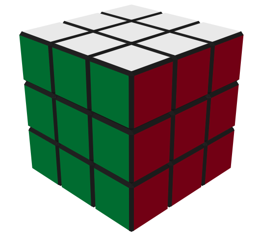
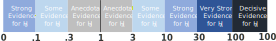
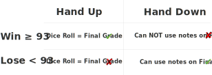

## Mike’s Dumb Casino {background-image="media/images/w7_dumb_casino.svg" background-position="center" background-size="85%" background-repeat="no-repeat" fig-alt="Ruin your grades for statistics"}

*For Entertainment Purposes Only!!*

## Steps in Hypothesis Testing

1.  [*What statistical story am I attempting to tell?*]{.muted}

<br>

2.  [*What have I estimated or plotted to go along with that story and what is my conclusion from those estimates alone? If there was no uncertainty in these estimates, what should the business do?*]{.muted}

<br>

3.  [*Which test is appropriate and what is the null hypothesis?*]{.muted}

<br>

4.  [*What is the statistical interpretation of the test result?*]{.muted}

<br>

5.  *What is the practical interpretation of this analysis for a business audience?\
    Are my estimates precise enough to tell the story I outlined in part (2)?*

```{r setup, include=FALSE}
library(dplyr)
library(stringr)
library(purrr)
library(eco230r)
library(here)
library(readr)

data_path <- here("week06","data","tonic_10_studies_data.csv") 
data_hack <- here("week06","data","study10_sample_size_p_hacking.csv") 

sf <- read_csv(data_path, show_col_types = FALSE)
nf <- read_csv(data_hack, show_col_types = FALSE)

# helper to parse ost() $results string
parse_ost_results <- function(res_string){
  # res_string looks like: "t(99) = 1.895, p = 0.061, d = 0.187, bf10 = 0.617"
  tibble(
    T_crit_stat = as.numeric(str_match(res_string, "t\\([^\\)]+\\)\\s*=\\s*([-0-9\\.]+)")[,2]),
    p           = as.numeric(str_match(res_string, "p\\s*=\\s*([-0-9\\.]+)")[,2]),
    d           = as.numeric(str_match(res_string, "d\\s*=\\s*([-0-9\\.]+)")[,2]),
    bf10        = as.numeric(str_match(res_string, "bf10\\s*=\\s*([-0-9\\.]+)")[,2]),
    res         = as.character(res_string)
  )
}

ci_summary <- sf %>%
  group_by(study_index) %>%
  group_modify(~{
    dat <- .x

    # descriptive stats
    N  <- nrow(dat)
    M  <- mean(dat$change_score, na.rm = TRUE)
    SD <- sd(dat$change_score, na.rm = TRUE)
    SE <- sd(dat$change_score, na.rm = TRUE) / sqrt(N)

    # ost() stats
    o <- ost(dat$change_score, mu = 0)
    parsed <- parse_ost_results(o$results)

    # your simple CI rule
    x <- 1.96
    margin <- x * SE
    
    tcrit <- qt(0.975, N-1)
    margin <- tcrit * SE

    tibble(
      N = N,
      Mean = M,
      StDev = SD,
      Standard_Error = SE,
      tCrit = tcrit,
      margin_of_error = margin,
      lower_bound = M - margin,
      upper_bound = M + margin
    ) %>%
      bind_cols(parsed)
  }) %>%
  ungroup() %>%
  arrange(study_index)

ci_summary

n_summary <- nf %>%
  group_by(study_index) %>%
  group_modify(~{
    dat <- .x

    # descriptive stats
    N  <- nrow(dat)
    M  <- mean(dat$change_score, na.rm = TRUE)
    SD <- sd(dat$change_score, na.rm = TRUE)
    SE <- sd(dat$change_score, na.rm = TRUE) / sqrt(N)

    # ost() stats
    o <- ost(dat$change_score, mu = 0)
    parsed <- parse_ost_results(o$results)

    # your simple CI rule
    x <- 1.96
    margin <- x * SE
    
    tcrit <- qt(0.975, N-1)
    margin <- tcrit * SE

    tibble(
      N = N,
      Mean = M,
      StDev = SD,
      Standard_Error = SE,
      tCrit = tcrit,
      margin_of_error = margin,
      lower_bound = M - margin,
      upper_bound = M + margin
    ) %>%
      bind_cols(parsed)
  }) %>%
  ungroup() %>%
  arrange(study_index)


```

# Inference Review

## What effect does it have on test scores?

::::: columns
::: {.column width="95%"}
```{r}
library(ggplot2)
library(dplyr)

plot_df <- ci_summary %>%
  mutate(
    study_label = paste("Study", study_index),
    study_f = factor(study_label, levels = rev(study_label))
  )

ggplot(plot_df, aes(y = study_f)) +
  # put the advertised line in the background
  geom_vline(xintercept = 10, linewidth = 1.1, color = "darkseagreen4", alpha = 0.7) +

  # CI lines (use height, not width)
  geom_errorbarh(
    aes(xmin = lower_bound, xmax = upper_bound),
    height = 0.18, linewidth = 1.2, color = "grey20"
  ) +

  # mean dots
  geom_point(aes(x = Mean), size = 5, color = "grey20") +

  # DON'T clip CIs: use coord_cartesian instead of limits=
  coord_cartesian(xlim = c(-20, 35), clip = "off") +

  scale_x_continuous(
    breaks = c(-10, 0, 10, 20, 30),
    labels = function(x){
      ifelse(x == 0, "0",
             paste0(ifelse(x > 0, "+", ""), x, " pts."))
    }
  ) +
  labs(x = NULL, y = NULL) +
  theme_minimal(base_size = 16) +
  theme(
    plot.margin = margin(10, 20, 10, 60),
    panel.grid.major.y = element_blank(),
    panel.grid.minor = element_blank(),
    panel.grid.major.x = element_blank(),
    axis.text.y = element_blank(),
    axis.ticks.y = element_blank(),
    axis.text.x = element_text(size = 16)
  )
```
:::

::: {.column width="5%"}
{fig-alt="Vintage snake oil bottle" style="position:absolute; top:10%; transform:translate(-50%,-50%) rotate(12deg); width:12%; height:auto;"}
:::
:::::

## Confidence Intervals

Intervals that contain the ‘true’ population value of the parameter in 95% of samples.

<br>

::: {style="color:#b30000; text-decoration:line-through; text-decoration-thickness:3px;"}
I’m 95% confident that the population value falls in this interval.
:::

<br>

::: {style="color:#b30000; text-decoration:line-through; text-decoration-thickness:3px;"}
An interval where there is a 95% probability that it contains the population value.
:::

<br><br>

**Probability of containing the population value is 0 or 1 but you can’t know which.**

::::: {.columns style="margin-top: 1.2rem;"}
::: {.column width="40%"}
{width="70%" fig-alt="Mystery box icon representing unknown truth."}
:::

::: {.column width="60%"}
<br><br><br> {width="80%" fig-alt="Generic confidence interval graphic with a point estimate and horizontal interval."}
:::
:::::

## Type I vs Type II Errors

::::::::::::::::: {style="position:relative; height:80vh;"}
<!-- Left image (false positive) -->

::: {style="position:absolute; left:1%; top:6%; width:46%; z-index:1;"}
{width="75%" fig-alt="Nurse giving a shot to a child; example of a false positive."}
:::

<!-- Left interrobang -->

::: {style="position:absolute; left:8%; top:3%; z-index:5;             font-size:3.2rem; font-weight:700; color:#c00000; transform:rotate(-15deg);"}
?!
:::

<!-- Left speech bubble -->

::: {style="position:absolute; left:32%; top:7.5%; z-index:6;             background:white; border:3px solid #2f66d0; border-radius:18px;             padding:0.75rem 1.05rem; font-size:1.55rem; font-weight:700;             line-height:1.15; text-align:center;"}
You’re<br>Pregnant!
:::

<!-- Bubble tail (approx) -->

::: {style="position:absolute; left:30.9%; top:15.8%; z-index:6;             width:22px; height:22px; background:white;             border-left:3px solid #2f66d0; border-bottom:3px solid #2f66d0;             transform:rotate(45deg);"}
:::

<!-- Left labels -->

::::: {style="position:absolute; left:11%; top:53%; z-index:7; text-align:center;"}
::: {style="font-size:2.1rem; font-weight:600; color:#333;"}
Type 1 error
:::

::: {style="font-size:2.0rem; font-weight:600; color:#8a8a8a;"}
False Positive
:::
:::::

<!-- Right image (false negative) -->

::: {style="position:absolute; left:52%; top:38%; width:46%; z-index:1;"}
{width="115%" fig-alt="Doctor telling a pregnant person they are not pregnant; example of a false negative."}
:::

<!-- Right interrobang -->

::: {style="position:absolute; left:93%; top:42%; z-index:5;             font-size:3.2rem; font-weight:700; color:#c00000; transform:rotate(18deg);"}
?!
:::

<!-- Right speech bubble -->

::: {style="position:absolute; left:51%; top:38%; z-index:6;             background:white; border:3px solid #2f66d0; border-radius:18px;             padding:0.75rem 1.05rem; font-size:1.55rem; font-weight:700;             line-height:1.15; text-align:center;"}
You’re Not<br>Pregnant!
:::

<!-- Bubble tail (approx) -->

::: {style="position:absolute; left:65.5%; top:45%; z-index:6;             width:22px; height:22px; background:white;             border-left:3px solid #2f66d0; border-bottom:3px solid #2f66d0;             transform:rotate(-135deg);"}
:::

<!-- Right labels -->

::::: {style="position:absolute; left:70%; top:28%; z-index:7; text-align:center;"}
::: {style="font-size:2.1rem; font-weight:600; color:#333;"}
Type 2 error
:::

::: {style="font-size:2.0rem; font-weight:600; color:#8a8a8a;"}
False Negative
:::
:::::
:::::::::::::::::

## p Value

The probability of getting a test statistic at least as extreme as the one you observed\
**given that** H<sub>0</sub> is true.

<br>

::: {style="color:#b30000; text-decoration:line-through; text-decoration-thickness:3px;"}
The probability of a chance result.
:::

::: {style="color:#b30000; text-decoration:line-through; text-decoration-thickness:3px;"}
The probability that H<sub>A</sub> is true.
:::

::: {style="color:#b30000; text-decoration:line-through; text-decoration-thickness:3px;"}
The probability that H<sub>0</sub> is true.
:::

<br>

**The Type I error in this study is 0 or 1 we can't know which.**

<br>

:::::: columns
::: {.column width="40%"}
{width="60%"}
:::

:::: {.column width="60%"}
::: {style="font-size:2.4rem; font-weight:700; text-align:center; margin-top:1rem;"}
p = 0.027
:::
::::
::::::

## p Value

<br>

Tells us nothing about importance because p depends on sample size

Provides little evidence about the null hypothesis

Encourages all-or-nothing thinking

Based on long-run probabilities

p is the relative frequency of our observed test statistic relative to all test statistics from an infinite number of experiments.

<br>

::::: columns
::: {.column width="40%"}
{width="55%" fig-alt="Twenty-sided die representing randomness under the null hypothesis."}
:::

::: {.column width="60%"}
:::
:::::

## What effect does it have on test scores?

::::: columns
::: {.column width="95%"}
```{r}
library(ggplot2)
library(dplyr)

plot_df <- ci_summary %>%
  mutate(
    study_f = factor(study_index, levels = rev(study_index)),
    p_label = paste0("p = ", sprintf("%.3f", p))
  )

ggplot(plot_df, aes(y = study_f)) +

  # Red reference line at 0 (null effect)
  geom_vline(xintercept = 0, linewidth = 1.2,
             color = "red3", alpha = 0.8) +

  # Confidence intervals
  geom_errorbarh(
    aes(xmin = lower_bound, xmax = upper_bound),
    height = 0.18, linewidth = 1.2, color = "grey20"
  ) +

  # Mean points
  geom_point(aes(x = Mean),
             size = 5, color = "grey20") +

  # Left-side p-value labels
  geom_text(
    aes(x = -30
        , label = p_label),
    hjust = 0, size = 5,
    color = "red3", fontface = "italic"
  ) +

  coord_cartesian(xlim = c(-20, 35), clip = "off") +

  scale_x_continuous(
    breaks = c(-20, -10, 0, 10, 20, 30),
    labels = function(x){
      ifelse(x == 0, "0",
             paste0(ifelse(x > 0, "+", ""), x, " pts."))
    }
  ) +

  labs(x = NULL, y = NULL) +

  theme_minimal(base_size = 16) +
  theme(
    plot.margin = margin(10, 20, 10, 80),
    panel.grid.major.y = element_blank(),
    panel.grid.minor = element_blank(),
    panel.grid.major.x = element_blank(),
    axis.text.y = element_blank(),
    axis.ticks.y = element_blank(),
    axis.text.x = element_text(size = 16)
  )
```
:::

::: {.column width="5%"}
{fig-alt="Vintage snake oil bottle" style="position:absolute; top:10%; transform:translate(-50%,-50%) rotate(12deg); width:12%; height:auto;"}
:::
:::::

# Providing Context
Effect Size

## Effect Sizes

### Effect sizes describe the **size of a relationship or difference**.

- How big is the **effect?**
- Is the difference **meaningful** in practice?
- How much of the outcome is **explained?**

<div style="display:grid; grid-template-columns:1fr 1fr 1fr; font-weight:700; text-align:center; color:white; margin-top:.25em;">
<div style="background:#cfe8cf; padding:.55em;">Small</div>
<div style="background:#7fc97f; padding:.55em;">Medium</div>
<div style="background:#2e8b57; padding:.55em;">Large</div>
</div>

<br>

:::: fragment

- Larger effect sizes mean a **stronger relationship, bigger difference,** or **more explained variation**.  
- Smaller effect sizes mean the pattern is **weaker**, even if it is statistically significant.

::::

<br>

:::: fragment

::: {.callout-important title="p-Value vs Effect Size"}
*p*-values answer **“Is it statistically detectable?”**, Effect sizes answer **“Is it practically meaningful?”**
:::

::::


## Effect Size Reference

::: {.columns}
::: {.column width="50%"}

### `csf()` / `csi()` / `idw()` / `psw()`

**χ² tests and Wilcoxon tests**

Cohen's ($w$), Cramer's ($V$), rank-biserial ($r_{rb}$)

<div style="display:grid; grid-template-columns:1fr 1fr 1fr; font-weight:700; text-align:center; color:white; margin-top:.25em;">
<div style="background:#cfe8cf; padding:.45em;">Small</div>
<div style="background:#7fc97f; padding:.45em;">Medium</div>
<div style="background:#2e8b57; padding:.45em;">Large</div>
</div>

<div style="display:grid; grid-template-columns:1fr 1fr 1fr; text-align:center; font-size:1.1rem; font-weight:700; margin-top:.08em;">
<div>.10</div>
<div>.30</div>
<div>.50</div>
</div>

<div style="font-size:.68em; line-height:1.15; margin-top:.2em;">
Negative values apply only to $r_{rb}$ where they show <strong>direction</strong>.
</div>

:::

::: {.column width="50%"}

### `idt()` / `pst()` / `ost()`

**t-tests**

Cohen's ($d$)

<div style="display:grid; grid-template-columns:1fr 1fr 1fr; font-weight:700; text-align:center; color:white; margin-top:.25em;">
<div style="background:#cfe8cf; padding:.45em;">Small</div>
<div style="background:#7fc97f; padding:.45em;">Medium</div>
<div style="background:#2e8b57; padding:.45em;">Large</div>
</div>

<div style="display:grid; grid-template-columns:1fr 1fr 1fr; text-align:center; font-size:1.1rem; font-weight:700; margin-top:.08em;">
<div>.20</div>
<div>.50</div>
<div>.80</div>
</div>

<div style="font-size:.68em; line-height:1.15; margin-top:.2em;">
Negative values show <strong>direction of the mean difference</strong>, not magnitude.
</div>

:::
:::

\vspace{0.25em}

::: {.columns}
::: {.column width="50%"}

### `ano()`

**ANOVA**

$\omega^2$, $\xi$

<div style="display:grid; grid-template-columns:1fr 1fr 1fr; font-weight:700; text-align:center; color:white; margin-top:.25em;">
<div style="background:#cfe8cf; padding:.45em;">Small</div>
<div style="background:#7fc97f; padding:.45em;">Medium</div>
<div style="background:#2e8b57; padding:.45em;">Large</div>
</div>

<div style="display:grid; grid-template-columns:1fr 1fr 1fr; text-align:center; font-size:1.1rem; font-weight:700; margin-top:.08em;">
<div>.01</div>
<div>.06</div>
<div>.14</div>
</div>

<div style="font-size:.68em; line-height:1.15; margin-top:.2em;">
Usually interpreted as <strong>size only</strong>.
</div>

:::

::: {.column width="50%"}

### `slr()`

**Linear regression**

$R^2$

<div style="display:grid; grid-template-columns:1fr 1fr 1fr; font-weight:700; text-align:center; color:white; margin-top:.25em;">
<div style="background:#cfe8cf; padding:.45em;">Small</div>
<div style="background:#7fc97f; padding:.45em;">Medium</div>
<div style="background:#2e8b57; padding:.45em;">Large</div>
</div>

<div style="display:grid; grid-template-columns:1fr 1fr 1fr; text-align:center; font-size:1.1rem; font-weight:700; margin-top:.08em;">
<div>.02</div>
<div>.13</div>
<div>.26</div>
</div>

<div style="font-size:.68em; line-height:1.15; margin-top:.2em;">
Interpreted as <strong>proportion of variance explained</strong>.
</div>

:::
:::

<div style="font-size:.68em; line-height:1.15; margin-top:.35em;">
<strong>Quick rule:</strong>
Negative values matter for <strong>$d$</strong> and sometimes <strong>$r_{rb}$</strong> because they show <strong>direction</strong>.<br>
For <strong>$w$, $V$, $\omega^2$, $\xi$, and $R^2$</strong>, values are interpreted as <strong>size only</strong>.
</div>

# Providing Context
Bayes Factor

##  {background-color="black"}

[ A participant is given a randomly scrambled cube. They solve the cube successfully. You want to reward them with 10 extra credit points, but only if they have practiced. What are the odds that the participant <u>actually practiced</u>? ]{style="color:white;"}

<br>

[ Apart from the fact that they solved the cube, you know nothing about this participant. ]{style="color:white;"}

<br><br>

:::::: columns
::: {.column width="45%"}
### [How many Practiced: 1%]{style="color:white;"}

<br>

### [True Positives: 90%]{style="color:white;"}

<br>

### [True Negatives: 91%]{style="color:white;"}
:::

:::: {.column width="55%"}
::: {style="margin-left:80px;"}
### [A) 9 in 10]{style="color:#f4c20d;"}

<br>

### [B) 8 in 10]{style="color:#f4c20d;"}

<br>

### [C) 1 in 10]{style="color:#f4c20d;"}

<br>

### [D) 1 in 100]{style="color:#f4c20d;"}
:::
::::
::::::

## [Choosing and appropriate test]{.sr-only}

<br>

::::::::::::::::: columns
:::::::::::: {.column width="62%"}
::::: {style="margin-bottom:3.5rem;"}
::: {style="font-size:1.5rem; font-weight:600;"}
Report Hypothesis
:::

::: {style="font-size:2.3rem; font-weight:700; margin-top:0.4rem;"}
Participants who have practiced will be able to solve a cube.
:::
:::::

::::: {style="margin-bottom:3.5rem;"}
::: {style="font-size:1.5rem; font-weight:600;"}
Null Hypothesis
:::

::: {style="font-size:2.3rem; font-weight:700; margin-top:0.4rem;"}
H<sub>0</sub>: Participant did not practice
:::
:::::

<div>

::: {style="font-size:1.5rem; font-weight:600;"}
Alternate Hypothesis
:::

::: {style="font-size:2.3rem; font-weight:700; margin-top:0.4rem;"}
H<sub>A</sub>: Participant practiced
:::

</div>
::::::::::::

:::::: {.column width="38%"}
::::: {style="position: relative; height: 70vh;"}
<!-- Unsolved cube: align with Null Hypothesis -->

::: {style="position:absolute; left:50%; top:32%; transform:translateX(-50%);"}
{width="80%" fig-alt="Unsolved Rubik's cube."}
:::

<!-- Solved cube: align with Alternate Hypothesis -->

::: {style="position:absolute; left:50%; top:61%; transform:translateX(-50%);"}
{width="80%" fig-alt="Solved Rubik's cube."}
:::
:::::
::::::
:::::::::::::::::

## Confusion Matrix

:::::::::::: {style="position: relative; height: 85vh;"}
<!-- Vertical Divider -->

::: {style="position:absolute; left:50%; top:0; bottom:0; width:2px; background:#777;"}
:::

<!-- LEFT SIDE (PASS) -->

:::::: {style="position:absolute; left:0; width:50%; text-align:center;"}
::: {style="font-size:2.2rem; font-weight:700; color:#4b7f2a; margin-top:1rem;"}
Pass
:::

::: {style="margin-top:1.5rem;"}
[{width="38%" fig-alt="Solved Rubik's cube."}](https://shiny.60land.com/week07/bayes/){target="_blank"}
:::

::: {style="margin-top:3rem;"}
+-------------------+----------------+
| H~0~: No Practice | H~A~: Practice |
+===================+================+
| **Type 1 Error**\ | **No Error**\  |
| False Positive    | True Positive  |
+-------------------+----------------+
:::
::::::

<!-- RIGHT SIDE (FAIL) -->

:::::: {style="position:absolute; right:0; width:50%; text-align:center;"}
::: {style="font-size:2.2rem; font-weight:700; color:#b30000; margin-top:1rem;"}
Fail
:::

::: {style="margin-top:1.5rem;"}
[{width="38%" fig-alt="Solved Rubik's cube."}](https://shiny.60land.com/week07/bayes/){target="_blank"}
::::

::: {style="margin-top:3rem;"}
+-------------------+-------------------+
| H~0~: No Practice | H~A~: Practice    |
+===================+===================+
| **No Error**\     | **Type 2 Error**\ |
| True Negative     | False Negative    |
+-------------------+-------------------+
:::
::::::
::::::::::::

## {background-image="media/images/w7_bayes_1.png" background-position="center" background-size="80%" background-repeat="no-repeat" fig-alt="Bayes Factor"}

## {background-image="media/images/w7_bayes_2.png" background-position="center" background-size="80%" background-repeat="no-repeat" fig-alt="Bayes Factor"}

## {background-image="media/images/w7_bayes_3.png" background-position="center" background-size="80%" background-repeat="no-repeat" fig-alt="Bayes Factor"}

## {background-image="media/images/w7_bayes_4.png" background-position="center" background-size="80%" background-repeat="no-repeat" fig-alt="Bayes Factor"}

## {background-image="media/images/w7_bayes_5.png" background-position="center" background-size="80%" background-repeat="no-repeat" fig-alt="Bayes Factor"}

## {background-image="media/images/w7_bayes_6.png" background-position="center" background-size="80%" background-repeat="no-repeat" fig-alt="Bayes Factor"}

## 

:::::: {style="text-align:center; font-size:1.25em; line-height:1.6;"}
::: {.fragment .strike style="text-decoration-thickness:3px;"}
Tests determine if you have a disease.
:::

<br>

::: {.fragment .strike style="text-decoration-thickness:3px;"}
Tests determine [your chances of having]{style="color:#2F5597;"} a disease.
:::

<br>

Tests [update]{style="color:#548235;"} [your chances of having]{style="color:#2F5597;"} a disease.

<br><br>

::: fragment
**Bayes Factor (bf10) quantifies relative probability of data given the null and alternate hypotheses.**
:::
::::::

##  {background-color="black"}

[A patient participates in a routine cancer screening. They test positive and are alarmed, they want to know from you whether they have cancer for certain or what their chances are.]{style="color:white;"}

<br>

[Apart from the screening results you know nothing about this patient.]{style="color:white;"}

<br><br>

:::::: columns
::: {.column width="45%"}
### [Prevalence: 1%]{style="color:white;"}

<br>

### [Sensitivity: 90%]{style="color:white;"}

<br>

### [Specificity: 91%]{style="color:white;"}
:::

:::: {.column width="55%"}
::: {style="margin-left:80px;"}
### [A) 9 in 10]{style="color:#f4c20d;"}

<br>

### [B) 8 in 10]{style="color:#f4c20d;"}

<br>

### [C) 1 in 10]{style="color:#f4c20d;"}

<br>

### [D) 1 in 100]{style="color:#f4c20d;"}
:::
::::
::::::

## Never Report p Value Alone

<br>

Bayes Factor helps assess plausibility of hypothesis

Address more useful questions, less dependent on n, avoid all or nothing thinking

Effect Sizes and Bayes Factors are on a continuum

Bayes Factor gives you a sense of how you should update your beliefs based on the data

<br>

{width="100%" fig-alt="Bayes Factor Interpretation rules of thumb"}

## Mike's Dumb Casino

:::::: columns
::: {.column width="50%"}

#### What happened?

- Before seeing the tens die  
  **Chance of winning = 7%**

- After seeing **90 on the tens die**  
  **Chance of winning = 70%**

#### What evidence strength causes this update?

Prior odds:

$$
\frac{0.07}{0.93} \approx 0.075
$$

Posterior odds:

$$
\frac{0.70}{0.30} \approx 2.33
$$

Evidence multiplier:

$$
BF_{10} \approx \frac{2.33}{0.075} \approx 31
$$
:::

::: {.column width="50%"}
{width="95%"}

<br>
<br>
<br>

{width="95%"}

**Seeing the tens die = 90 provides about 30:1 evidence for winning.**

:::

::::::

# Providing Context
Interpreting Results

## 

### What is the practical interpretation of this analysis for a business audience? Are my estimates precise enough to tell the story I outlined in part (2)?

<div class="columns">

::: {.column width="40%"}


{width="55%"}

:::

::: {.column width="60%"}

<div style="font-size:1.4rem; font-weight:600; margin-bottom:0.5rem;">
**$\mu$ = 9.5, C.I. = [0.77, 17.8]**
</div>

<div style="display:flex; align-items:center; gap:1rem; margin-bottom:1.5rem;">

{width="70%"}

</div>

<div style="font-size:1.4rem; margin-bottom:0.8rem;">
**p = 0.032**
</div>

<div style="font-size:1.2rem; margin-bottom:1.5rem;">
*If p is low the H<sub>0</sub> (null) must go.*
</div>

<div style="font-size:1.3rem; margin-bottom:0.6rem;">
**d = 0.281**
</div>

<!-- Effect size bar -->
<div style="display:flex; width:80%; height:55px; font-weight:600; text-align:center; color:white; margin-bottom:1.8rem;">

<div style="flex:1; background:#b8d2b8; display:flex; align-items:center; justify-content:center;">
Small
</div>

<div style="flex:1; background:#7fbc7a; display:flex; align-items:center; justify-content:center;">
Medium
</div>

<div style="flex:1; background:#2f8b57; display:flex; align-items:center; justify-content:center;">
Large
</div>

</div>

<div style="font-size:1.3rem; margin-bottom:0.6rem;">
**bf10 = 3.770**
</div>

{width="100%"}

:::

</div>


## `library(eco230r)`

::::: columns

::: {.column width="10%"}

{width="100%" fig-alt="R Language Logo"}

:::


::: {.column width="90%"}

```{r setup_t echo:FALSE, include:FALSE, message=FALSE, warning=FALSE, results="hide"}
abb_path <- here("shared","data","airbnb_chicago.csv") 
df <- read_csv(abb_path, show_col_types = FALSE)

h1 <- df %>%
  csi(bed_type~room_type)

h2 <- df %>%
  idt(listed_price~cleaning_fee)

h3 <- df %>%
  ano(listed_price~bed_type)

```

```{r show_x, echo=TRUE, results="hide", message=FALSE, warning=FALSE}
h1 <- df %>%
  csi(bed_type~room_type)
```

### h1$results

**`r h1$results`**

<br>

```{r show_t, echo=TRUE, results="hide", message=FALSE, warning=FALSE}
h2 <- df %>%
  idt(listed_price~cleaning_fee)
```

### h2$results

**`r h2$results`**

<br>

```{r show_a, echo=TRUE, results="hide", message=FALSE, warning=FALSE}
h3 <- df %>%
  ano(listed_price~bed_type)
```

### h3$results

**`r h3$results`**

:::

:::::

## What effect does it have on test scores?

::::: columns
::: {.column width="95%"}
```{r}
library(ggplot2)
library(dplyr)

plot_df <- ci_summary %>%
  mutate(
    study_f = factor(study_index, levels = rev(study_index))
  )

ggplot(plot_df, aes(y = study_f)) +

  # Null reference line
  geom_vline(
    xintercept = 0,
    linewidth = 1.2,
    color = "red3",
    alpha = 0.8
  ) +

  # Confidence intervals
  geom_errorbarh(
    aes(xmin = lower_bound, xmax = upper_bound),
    height = 0.18,
    linewidth = 1.2,
    color = "grey20"
  ) +

  # Mean points
  geom_point(
    aes(x = Mean),
    size = 5,
    color = "grey20"
  ) +

  # Result labels
  geom_text(
    aes(x = -63, label = res),
    hjust = 0,
    size = 5
  ) +

  coord_cartesian(
    xlim = c(-20, 35),
    clip = "off"
  ) +

  scale_x_continuous(
    breaks = c(-20, -10, 0, 10, 20, 30),
    labels = function(x){
      ifelse(x == 0, "0",
             paste0(ifelse(x > 0, "+", ""), x, " pts."))
    }
  ) +

  labs(x = NULL, y = NULL) +

  theme_minimal(base_size = 16) +
  theme(
    plot.margin = margin(10, 20, 10, 290),
    panel.grid.major.y = element_blank(),
    panel.grid.minor = element_blank(),
    panel.grid.major.x = element_blank(),
    axis.text.y = element_blank(),
    axis.ticks.y = element_blank(),
    axis.text.x = element_text(size = 16)
  )
```
:::

::: {.column width="5%"}
{fig-alt="Vintage snake oil bottle" style="position:absolute; top:10%; transform:translate(-50%,-50%) rotate(12deg); width:12%; height:auto;"}
:::
:::::

## p Value hacking

::::: columns
::: {.column width="95%"}
```{r}
library(ggplot2)
library(dplyr)

plot_df <- n_summary %>%
  arrange(N) %>%
  mutate(
    study_f = factor(study_index, levels = rev(study_index))
  )

ggplot(plot_df, aes(y = study_f)) +

  # Null reference line
  geom_vline(
    xintercept = 0,
    linewidth = 1.2,
    color = "red3",
    alpha = 0.8
  ) +

  # Confidence intervals
  geom_errorbarh(
    aes(xmin = lower_bound, xmax = upper_bound),
    height = 0.18,
    linewidth = 1.2,
    color = "grey20"
  ) +

  # Mean points
  geom_point(
    aes(x = Mean),
    size = 5,
    color = "grey20"
  ) +

  # Result labels
  geom_text(
    aes(x = -64, label = res),
    hjust = 0,
    size = 5
  ) +

  coord_cartesian(
    xlim = c(-20, 35),
    clip = "off"
  ) +

  scale_x_continuous(
    breaks = c(-20, -10, 0, 10, 20, 30),
    labels = function(x){
      ifelse(x == 0, "0",
             paste0(ifelse(x > 0, "+", ""), x, " pts."))
    }
  ) +

  labs(x = NULL, y = NULL) +

  theme_minimal(base_size = 16) +
  theme(
    plot.margin = margin(10, 20, 10, 290),
    panel.grid.major.y = element_blank(),
    panel.grid.minor = element_blank(),
    panel.grid.major.x = element_blank(),
    axis.text.y = element_blank(),
    axis.ticks.y = element_blank(),
    axis.text.x = element_text(size = 16)
  )
```
:::

::: {.column width="5%"}
{fig-alt="Vintage snake oil bottle" style="position:absolute; top:10%; transform:translate(-50%,-50%) rotate(12deg); width:12%; height:auto;"}


:::
:::::


