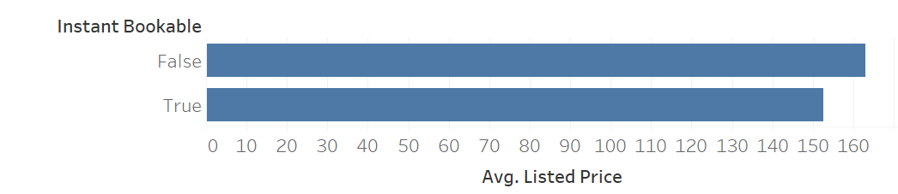
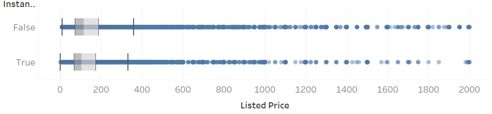

```{r}
#| include: false
library(tidyverse)
library(eco230r)
options(scipen = 999)
```

::: {.callout-note appearance="minimal" icon="false" title="Purpose"}
This assignment helps you interpret tests that compare a numeric outcome with a
reference value or between two groups.

You will review a worked independent-samples t-test, complete two
interpretations for a Wilcoxon rank-sum test, and attempt a test connected to
your project.
:::

## Objectives

By the end of this assignment, you will be able to:

- distinguish t-tests from Wilcoxon alternatives;
- interpret p-values in relation to a contextual null hypothesis;
- use effect size and Bayes factor in a practical interpretation; and
- complete the five-step process for a project-related test.

## Resources

- Week 6-8 slides and interpretation resources
- The four `.csv` files in the `data` folder
- `idt()`, `idw()`, `pst()`, `psw()`, and `ost()` from `eco230r`
- Your project story and candidate hypotheses

::: {.callout-tip appearance="minimal" icon="false" title="Expectations"}
This assignment is graded for correct use of the five-step process and
interpretations that connect the test result, effect size, and business context.
Your project code may be incomplete, but it must show the test you attempted.
:::

## 1) Review the Worked Example

The Airbnb dataset is used for the first two hypotheses. Do not change this
setup code.

```{r}
df <- read.csv(file.path("data", "airbnb_chicago.csv"))
```

### Hypothesis 1 - Worked Example

1. **Statistical story:** What relationship, difference, or pattern are you
   investigating, and why might it matter?

   Properties that are instantly bookable have a different mean listed price
   than properties that are not instantly bookable. Booking policy may be one
   pricing decision available to property owners.

2. **Estimate or plot:** What does the descriptive evidence suggest? If there
   were no uncertainty, what action would the business take?

   {fig-alt="A bar chart comparing average listed price for properties that are and are not instantly bookable."}

   Instantly bookable properties appear to have a lower mean listed price. If
   there were no uncertainty, an owner would consider whether booking policy is
   associated with the price the market supports.

3. **Test and hypotheses:** Which test is appropriate? State $H_0$, $H_A$,
   and the alpha level.

   Test: independent-samples t-test using `idt()`

   $H_0$: Mean listed price is equal for instantly bookable and non-instantly
   bookable properties.

   $H_A$: Mean listed price differs between instantly bookable and
   non-instantly bookable properties.

   $\alpha = 0.05$

```{r}
#| output: false
h1 <- df |>
  idt(listed_price ~ instant_bookable)

print(h1)
```

4. **Statistical interpretation:** What does the result say about the evidence
   against $H_0$? Report the relevant estimate and uncertainty in context.

   `r h1$results`

   Because the p-value is below 0.05, reject $H_0$. The sample provides
   evidence that mean listed price differs by instant-bookable status.

5. **Practical interpretation:** How large and consequential is the result for a
   general business audience? Use the effect size and Bayes factor when they
   help support the conclusion.

   Instantly bookable properties have a lower sample mean. The small Cohen's
   `$d$` suggests booking policy explains little price variation. Although the
   Bayes factor supports a difference, an owner should weigh larger drivers such
   as location, size, and amenities before changing policy.

---

## 2) Complete the Statistical and Practical Interpretations

### Hypothesis 2 - Complete Steps 4-5

1. **Statistical story:** Properties that are instantly bookable have a
   different median listed price than properties that are not.

2. **Estimate or plot:** The distribution is highly skewed, making the median a
   useful description of the center.

   {fig-alt="Two boxplots compare the skewed listed-price distributions for instantly bookable and non-instantly bookable properties."}

3. **Test and hypotheses:**

   Test: Wilcoxon rank-sum test using `idw()`

   $H_0$: The listed-price distributions do not differ by instant-bookable
   status.

   $H_A$: The listed-price distributions differ by instant-bookable status.

   $\alpha = 0.05$

```{r}
#| output: false
h2 <- df |>
  idw(listed_price ~ instant_bookable)

print(h2)
```

4. **Statistical interpretation:** What does the result say about the evidence
   against $H_0$? Report the result in context.

   `r h2$results`

   *Your response:*


5. **Practical interpretation:** How large and consequential is the result for a
   general business audience? Compare the conclusion with Hypothesis 1 and use
   the effect size and Bayes factor when they help.

   *Your response:*


---

## 3) Complete a Project-Related Test

### Hypothesis 3 - Complete the Full Analysis

Choose the dataset associated with your project.

| Project dataset | Filename |
|---|---|
| Wisconsin traffic accidents | `accident_wi.csv` |
| Chicago Airbnb listings | `airbnb_chicago.csv` |
| Wisconsin hospital charges | `hospital_charges_wi.csv` |
| Mason Crosby special-teams plays | `nfl_special_MasonCrosby.csv` |

Change `project_file` below. Do not change the `data` folder name.

```{r}
project_file <- "accident_wi.csv"
project_data <- read.csv(
  file.path("data", project_file),
  check.names = FALSE
)

cat(
  project_file, "contains", nrow(project_data), "rows and",
  ncol(project_data), "columns."
)
```

1. **Statistical story:** What relationship, difference, or pattern are you
   investigating, and why might it matter?

   *Your response:*


2. **Estimate or plot:** Create or describe an estimate or plot. What does the
   descriptive evidence suggest? If there were no uncertainty, what action would
   the business take?

   *Your response:*


3. **Test and hypotheses:** Select `idt()`, `idw()`, `pst()`, `psw()`, or
   `ost()`. State $H_0$, $H_A$, and the alpha level.

   **Test:**

   $H_0$:

   $H_A$:

   $\alpha = 0.05$

```{r}
# Replace the placeholders; comment out code that does not run.
# h3 <- project_data |> idt(numeric_outcome ~ two_group_variable)
# print(h3)
```

4. **Statistical interpretation:** What does the result say about the evidence
   against $H_0$? If the test did not run, explain the error or decision point
   you reached.

   *Your response:*


5. **Practical interpretation:** Explain the direction, magnitude, and business
   consequence. Use effect size and Bayes factor if available. If the test did
   not run, explain what evidence you would need to complete the interpretation.

   *Your response:*


## Submission

Submit `Homework_07_IP.pdf` in Canvas with the Hypothesis 2 interpretations, all
five steps for Hypothesis 3, and your attempted code.

## Checklist

- [ ] I interpreted Hypothesis 2 and compared the Wilcoxon and t-test conclusions.
- [ ] I selected the correct project dataset and completed all five steps for Hypothesis 3.
- [ ] I preserved my code attempt and reviewed and submitted the PDF.

**Grading focus:** Your work will be evaluated for correct test selection,
contextual interpretation, appropriate use of effect size and Bayes factor, and
a sincere project-related analysis attempt.
