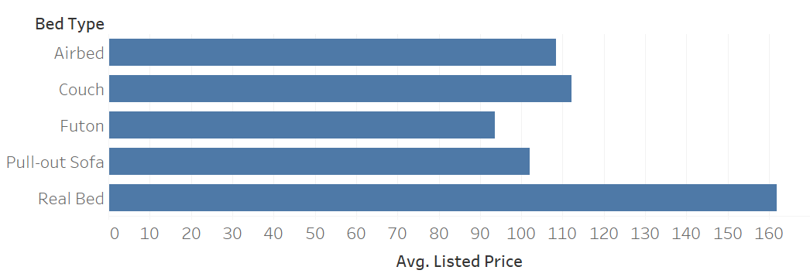
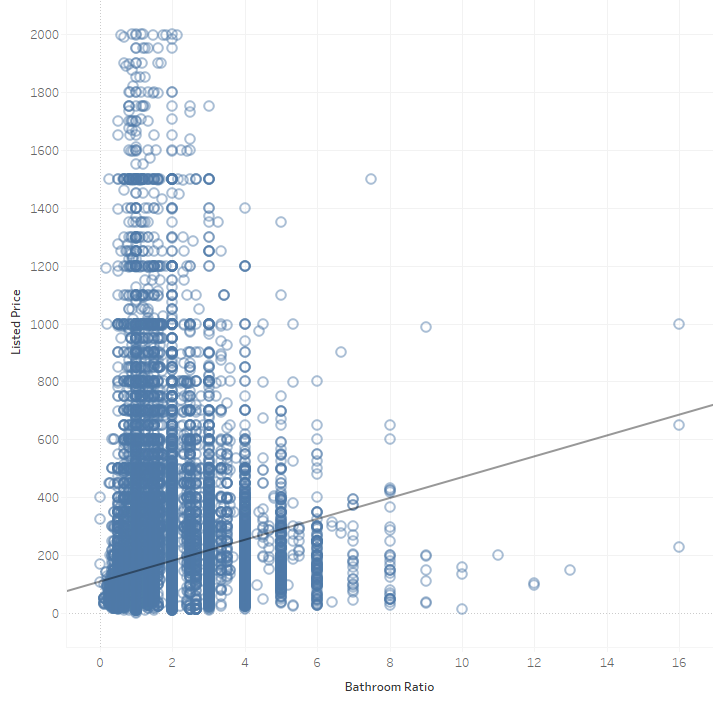

```{r}
#| include: false
library(tidyverse)
library(eco230r)
options(scipen = 999)
```

::: {.callout-note appearance="minimal" icon="false" title="Purpose"}
This assignment helps you interpret analyses involving three or more group
means and a linear relationship between two numeric variables.

You will review a worked one-way ANOVA, complete two interpretations for a
simple linear regression, and attempt one of these analyses using your project
dataset.
:::

## Objectives

By the end of this assignment, you will be able to:

- distinguish a one-way ANOVA from a simple linear regression;
- interpret an omnibus ANOVA and relevant post-hoc comparisons;
- interpret a regression slope and fitted equation in context;
- use effect size and Bayes factor in a practical interpretation; and
- complete the five-step process for a project-related analysis.

## Resources

- Week 6 and Week 9 slides and interpretation resources
- The `.csv` files in the `data` folder
- `ano()` and `slr()` from `eco230r`
- Your project story and candidate hypotheses

::: {.callout-tip appearance="minimal" icon="false" title="Expectations"}
This assignment is graded for correct use of the five-step process,
interpretations tied to the variables and evidence, and a clear distinction
between statistical evidence and practical importance.
:::

## 1) Review the Worked ANOVA Example

The larger Airbnb dataset is used for the first two hypotheses. Do not change
this setup code.

```{r}
df <- read.csv(file.path("data", "airbnb_full_oa.csv"))
```

### Hypothesis 1 - Worked Example

1. **Statistical story:** What relationship, difference, or pattern are you
   investigating, and why might it matter?

   Mean listed price differs across bed types. Property owners may use this
   information when describing and furnishing a listing.

2. **Estimate or plot:** What does the descriptive evidence suggest? If there
   were no uncertainty, what action would the business take?

   {fig-alt="A bar chart comparing average listed price across five bed-type categories."}

   Properties listing a real bed have the highest mean listed price. If there
   were no uncertainty, owners would prioritize a real bed when feasible while
   recognizing that bed type may also reflect other property characteristics.

3. **Test and hypotheses:** Which test is appropriate? State $H_0$, $H_A$,
   and the alpha level.

   Test: one-way ANOVA using `ano()`

   $H_0$: Population mean listed price is equal across all bed types.

   $H_A$: At least one population mean listed price differs by bed type.

   $\alpha = 0.05$

```{r}
#| output: false
h1 <- df |>
  ano(listed_price ~ bed_type)

print(h1)
```

4. **Statistical interpretation:** What does the result say about the evidence
   against $H_0$? Report the omnibus result and relevant post-hoc comparisons
   in context.

   `r h1$results`

   Because the omnibus p-value is below 0.05, reject $H_0$. Mean listed price
   is not equal across all bed types. The post-hoc results identify which pairs
   provide evidence of a difference; they should be reported from the current
   output rather than assumed from the plot alone.

5. **Practical interpretation:** How large and consequential is the result for a
   general business audience? Use the effect size and Bayes factor when they
   help support the conclusion.

   Real-bed listings have the highest sample mean. The reported effect size
   indicates whether between-group differences explain a small or substantial
   share of price variation, while the Bayes factor indicates the strength of
   evidence for those differences. Bed type may matter to pricing, but the
   observational data do not establish that changing a bed alone will cause a
   price increase; size, location, and amenities may also differ across groups.

---

## 2) Complete the Regression Interpretations

### Hypothesis 2 - Complete Steps 4-5

1. **Statistical story:** Listed price has a linear relationship with bathroom
   ratio, defined as beds per bathroom.

2. **Estimate or plot:** The plot suggests a positive relationship: listings
   with more beds per bathroom tend to have higher prices.

   {fig-alt="A scatterplot with a fitted line showing listed price increasing as beds per bathroom increases."}

3. **Test and hypotheses:**

   Test: simple linear regression using `slr()`

   $H_0: \beta_1 = 0$: Bathroom ratio has no linear association with listed
   price in the population.

   $H_A: \beta_1 \neq 0$: Bathroom ratio has a linear association with listed
   price in the population.

   $\alpha = 0.05$

```{r}
#| output: false
h2 <- df |>
  filter(bathrooms > 0) |>
  mutate(bathroom_ratio = beds / bathrooms) |>
  slr(listed_price ~ bathroom_ratio)

print(h2)
```

4. **Statistical interpretation:** What does the result say about the evidence
   against $H_0$? Report the slope, direction, p-value, and uncertainty in
   context.

   `r h2$results`

   *Your response:*


5. **Practical interpretation:** Explain the fitted equation for a general
   business audience. Interpret the slope, assess the magnitude and usefulness
   of the relationship, and use the effect size or Bayes factor when available.
   Do not present the association as proof that bathroom ratio causes price.

   *Your response:*


---

## 3) Complete a Project-Related Analysis

### Hypothesis 3 - Complete the Full Analysis

Choose the dataset associated with your project.

| Project dataset | Filename |
|---|---|
| Wisconsin traffic accidents | `accident_wi.csv` |
| Chicago Airbnb listings | `airbnb_chicago.csv` |
| Wisconsin hospital charges | `hospital_charges_wi.csv` |
| Mason Crosby special-teams plays | `nfl_special_MasonCrosby.csv` |

Change `project_file` below. Do not change the `data` folder name.

```{r}
project_file <- "accident_wi.csv"
project_data <- read.csv(
  file.path("data", project_file),
  check.names = FALSE
)

cat(
  project_file, "contains", nrow(project_data), "rows and",
  ncol(project_data), "columns."
)
```

1. **Statistical story:** What relationship, difference, or pattern are you
   investigating, and why might it matter?

   *Your response:*


2. **Estimate or plot:** Create or describe an estimate or plot. What does the
   descriptive evidence suggest? If there were no uncertainty, what action would
   the business take?

   *Your response:*


3. **Test and hypotheses:** Select either `ano()` or `slr()`. State $H_0$,
   $H_A$, and the alpha level.

   **Test:**

   $H_0$:

   $H_A$:

   $\alpha = 0.05$

```{r}
# Attempt one of the structures below with variables from your project.
# Keep code that does not yet work, but comment it out before rendering.

# ANOVA:
# h3 <- project_data |>
#   ano(numeric_outcome ~ group_variable)

# Simple linear regression:
# h3 <- project_data |>
#   slr(numeric_outcome ~ numeric_predictor)

# print(h3)
```

4. **Statistical interpretation:** What does the result say about the evidence
   against $H_0$? Report the relevant estimate and uncertainty. If the test did
   not run, explain the error or decision point you reached.

   *Your response:*


5. **Practical interpretation:** Explain the direction, magnitude, and business
   consequence. Use effect size and Bayes factor if available, and identify any
   important limitation. If the test did not run, explain what evidence you
   would need to complete the interpretation.

   *Your response:*


## Submission

Render this document and submit `Homework_08_IP.pdf` in Canvas. The PDF must
contain your two interpretations for Hypothesis 2, all five steps for Hypothesis
3, and the code you attempted.

## Checklist

- [ ] I completed the statistical and practical interpretations for Hypothesis 2.
- [ ] I interpreted the regression slope and did not imply unsupported causation.
- [ ] I selected the correct project dataset for Hypothesis 3.
- [ ] I completed all five steps using ANOVA or simple linear regression.
- [ ] I preserved or commented out the code I attempted.
- [ ] I reviewed and submitted `Homework_08_IP.pdf`.

**Grading focus:** Your work will be evaluated for correct ANOVA or regression
reasoning, contextual interpretation, appropriate use of effect size and Bayes
factor, and a sincere project-related analysis attempt.
