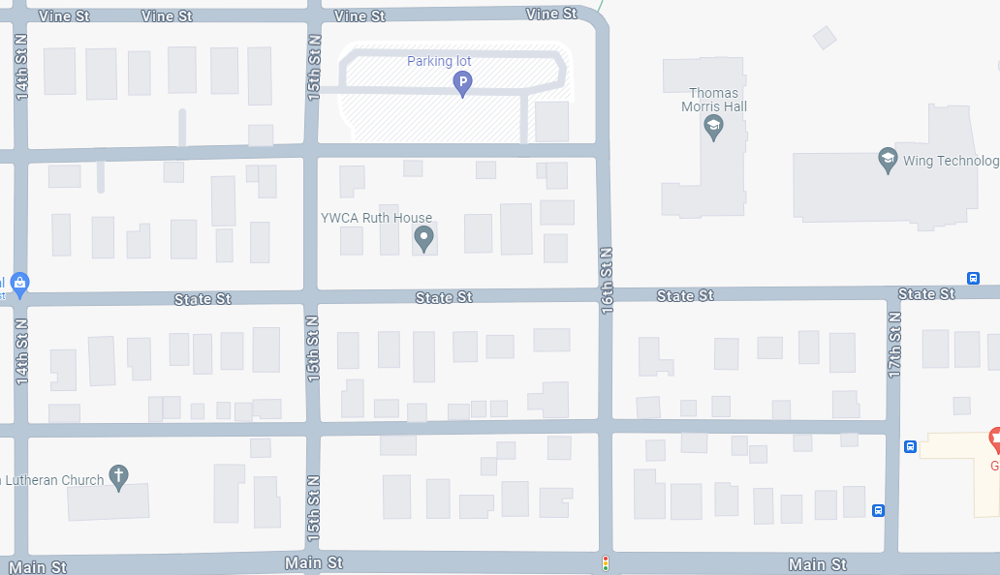
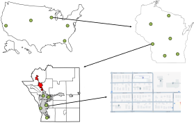
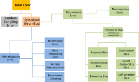
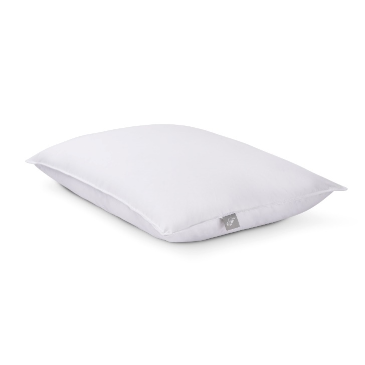

# Can a sample tell the truth?

 

::: {.callout-note title="Today's question"}
When does a small group of people tell us something useful about a much larger group?
:::

::: notes
Open with the idea that students already trust samples constantly: reviews, polls, product ratings, class feedback, medical studies.
:::

## First: take the survey

 

::: {.callout-important title="Class data lab"}
We are going to use your responses as today's dataset.
:::

 

1.  Take the survey.
2.  Do not overthink your answers.
3.  We will use the response pool to test sampling methods.

::: notes
Use the LimeSurvey link or QR code here once the final survey is active. Keep this slide up while students respond.
:::

## Today

 

1.  What a sample is trying to represent
2.  Random vs representative
3.  Sampling methods
4.  Sampling frame and nonresponse error
5.  Survey question design

# Population to Sample



## The Survey Pipeline

 

| Stage             | Question                      |
|-------------------|-------------------------------|
| Target population | Who do we want to understand? |
| Sampling frame    | Who could be selected?        |
| Planned sample    | Who did we try to select?     |
| Respondents       | Who actually answered?        |
| Final estimate    | What did we conclude?         |

::: notes
This replaces the old population -\> frame -\> sample sequence with the full measurement pipeline.
:::

# Random vs Representative

## The goal

 

::: {.callout-tip title="Good sample"}
A good sample is random enough to protect against selection bias and representative enough to reflect the population we care about.
:::

## Randomness is not the same as representativeness

 

|   | Representative | Not representative |
|------------------------|------------------------|------------------------|
| Random | Best case | Possible, especially with small samples or bad frames |
| Not random | Possible, but harder to defend | Common convenience-sample problem |

## Random

 

::: {.callout-note title="Random sample"}
Every unit in the frame has a known chance of being selected.
:::

 

Random sampling helps protect us from hidden selection rules.

It does not guarantee perfection in every single sample.

## Representative

 

::: {.callout-note title="Representative sample"}
The sample resembles the population on variables that matter for the question.
:::

 

Representative is about the result.

Random is about the process.

## Random but not representative

 

This can happen when:

-   the sample is small
-   the frame is flawed
-   an important subgroup is rare
-   the random draw is unlucky
-   nonresponse changes the final data

## Nonrandom but representative

 

This can happen, but it usually requires careful control.

Examples:

-   quota sampling
-   judgment sampling
-   balanced recruitment
-   post-stratification or weighting

::: {.callout-important title="Tradeoff"}
Nonrandom samples can be useful, but they are harder to defend.
:::

# Sampling Methods

## Same goal, different risks

 

Every sampling method is trying to answer:

> How do we learn about the population without measuring everyone?

 

But each method creates different risks.

## Probability Sampling {background-image="media/images/w12_go.jpeg" background-size="cover" background-position="center"}

  
Known chance of selection

  
Probability Sampling

  
Every unit in the frame has a known path into the sample. That makes the process easier to defend.

## Non Probability Sampling {background-image="media/images/w12_spider.jpeg" background-size="cover" background-position="center"}

  
Non Probability Sampling

  
Useful when speed or access matters, but the selection process is shaped by availability, judgment, or networks.

## Simple Random Sample {background-image="media/images/w12_bingo.jpeg" background-size="contain" background-position="center" background-color="#ffffff"}

  
Simple Random Sample

  

    Coin flip each row in the app.
    Fast way to make randomness visible without pretending every draw is perfectly representative.
  

## Systematic Sample {background-image="media/images/w12_hood_wide.png" background-size="contain" background-position="center" background-color="#ffffff"}

  
Systematic Sample

  
Every 6th house after a starting point

## Systematic Sample Walkthrough

  
  
+

  
&times;

  
&times;

  
&times;

  
&times;

  
+

  
&times;

  
&times;

  
&times;

  
&times;

  
+

  
&times;

  
&times;

  
&times;

  
&times;

  
+

  
&times;

  
&times;

  
&times;

  
&times;

  
+

  
&times;

  
&times;

  
&times;

  
&times;

  
+

  
&times;

  
&times;

  
&times;

  
&times;

  
+

  
&times;

  
&times;

  
&times;

  
&times;

  
+

  
&times;

  
&times;

  
&times;

  
&times;

  
+

  
&times;

  
&times;

  
&times;

  
&times;

  
+

  
&times;

  
&times;

  
&times;

  
&times;

  
+

  
&times;

  
&times;

  
&times;

  
&times;

  
Your exact route: start at the first house, then mark every 6th address.

## Convenience Sample {background-image="media/images/w12_marathon.jpeg" background-size="cover" background-position="center"}

  
Convenience Sample

## Stratified Sample {background-image="media/images/w12_red_white.jpeg" background-size="cover" background-position="center"}

  
Stratified Sample

## Quota Sample {background-image="media/images/w12_black_yellow.jpeg" background-size="cover" background-position="center"}

  
Quota Sample

## Cluster | Judgement | Snowball Sample {background-image="media/images/w12_larp.jpeg" background-size="cover" background-position="center"}

  
Cluster Sample | Judgement Sample | Snowball Sample

## Multistage Area Sample

{width=100%}

# Sampling Lab

## App Activity

 

In the app, choose:

1.  an outcome variable
2.  a sample size
3.  a sampling method
4.  a comparison group

 

Then ask:

> Did the sample look like the response pool?

## What to watch

 

::: tight-list
-   Sample estimate
-   Full response-pool estimate
-   Difference between the two
-   Class standing mix
-   Attendance mix
-   Work hours
-   Commute time
-   Early vs late responders
:::

## The important comparison

 

::: {.callout-tip title="Not just the estimate"}
Two samples can have similar averages but very different subgroup composition.
:::

 

Representation is about who is in the data, not just whether one number looks close.

## Random Sampling Error

 

::: {.callout-note title="Random sampling error"}
Random sampling error is the difference caused by selecting one random sample instead of another.
:::

 

It is noise from sampling.

It is not the same as bias.

## Bias Sources

{width=100%}

# Survey Design

## The transition

 

::: {.callout-important title="Measurement problem"}
Even if we sample the right people, we can still ask the wrong question.
:::

## Select One

 

Use select-one questions when respondents should choose one best answer.

Example:

> What is your primary way of getting to campus?

::: {.callout-tip title="Design check"}
Are the choices mutually exclusive enough for the question?
:::

## Select All That Apply

 

Use all-that-apply when multiple answers can be true.

Example:

> Which tools have you used for coursework this semester?

::: {.callout-important title="Interpretation warning"}
The percentages across choices usually do not add to 100%.
:::

## Likert Scale

 

Likert scales make attitudes easier to measure consistently.

Example:

> I feel confident interpreting statistical results.

 

Strongly disagree -\> Strongly agree

## Semantic Differential

 

Semantic differential scales measure perception between opposite ideas.

Example:

> Statistics feels...

 

Easy 1 2 3 4 5 6 7 Difficult

## Numeric Scales Need Anchors

 

Bad:

> Rate your confidence from 0 to 100.

 

Better:

> 0 = not confident at all\
> 50 = somewhat confident\
> 100 = completely confident

## Constant Sum

 

::: {.callout-note title="Constant sum"}
Respondents allocate a fixed number of points across options.
:::

 

Use it when you want prioritization.

Electronic surveys can enforce the total.

## Graphic Rating Scales

 

Graphic scales can help when numbers or words are difficult.

Useful in:

-   child surveys
-   low literacy contexts
-   medical pain scales
-   fatigue or communication difficulty

## Drilldown Questions

 

::: {.callout-note title="Drilldown"}
Start broad, then narrow the choices.
:::

 

Better than forcing people through a giant pick list.

Example:

College -\> Department -\> Major

## Collectively Exhaustive vs Mutually Exclusive

:::: {.q-example}
::: {.q-title}
Question categories can fail in different ways
:::

::: {.q-col .left}
::: {.col-head}
Collectively Exhaustive
:::

::: {.prompt}
How old are you?
:::

- 18-20
- 20-22
- 22-24

::: {.prompt}
How old are you?
:::

- < 18
- 18-20
- 20-22
- 22-24
- 24+
:::

::: {.q-col .right}
::: {.col-head}
Mutually Exclusive
:::

::: {.prompt}
How old are you?
:::

- 18-20
- 21-22
- 23-24

::: {.prompt}
How old are you?
:::

- < 18
- 18-20
- 21-22
- 23-24
- 25+
:::

{.food fig-alt="Birthday cake"}
::: {.frame}
:::
::::

## Generate Variance

:::: {.q-example}
::: {.q-title}
Generate Variance
:::

::: {.q-col .left}
:::{style="width: 46%;"}
::: {.prompt}
How many meals per day do you eat?
:::

- 0-5
- 6-10
- 11+

::: {.prompt}
How many meals per day do you eat?
:::

- Less than 1
- 1
- 2
- 3
- More than 3
:::
:::

{.food fig-alt="Potatoes"}
::::

## Sensitivity

:::: {.q-example}
::: {.q-title}
Sensitivity
:::

::: {.q-col .left}
::: {.prompt}
I am bored.
:::

- Strongly Disagree
- Disagree
- Neutral
- Agree
- Strongly Agree

::: {.prompt}
I am bored.
:::

- Disagree
- Agree

::: {.prompt}
I am bored.
:::

- Strongly Disagree
- Disagree
- Somewhat Disagree
- Agree
:::

::: {.q-col .right}
:::{style="font-size: 0.72rem;"}
::: {.prompt}
I am bored.
:::

- Extremely Very Strongly Disagree
- Very Strongly Disagree
- Strongly Disagree
- Disagree
- Extremely Very Moderately Disagree
- Very Moderately Disagree
- Moderately Disagree
- Extremely Very Somewhat Disagree
- Very Somewhat Disagree
- Somewhat Disagree
- Disagree Somewhat
- Kind of Disagree to some extent
- Not Really Disagree
- Neutral
- Moderately Neutral
- Extremely Neutral
- Neutrally Neutral
:::
:::

{.pillow fig-alt="Pillow"}
::::

## Heat Maps

 

Electronic surveys can collect information paper surveys cannot.

Example:

> Click the part of this chart that is most confusing.

 

Useful for testing:

-   visuals
-   dashboards
-   app screens
-   instructions

## Text Boxes

 

::: {.callout-tip title="Open text"}
Text boxes reveal categories the researcher did not anticipate.
:::

 

Example:

> What is something unique about you that a normal survey would not know to ask?

## From Text Boxes to Sampling

 

If someone writes:

> My obscure hobby is competitive speedcubing.

 

How would we sample that population?

::: {.callout-important title="Key link"}
Rare or niche populations often require judgment, cluster, or snowball sampling.
:::

# Bad Questions

## Leading Question

 

Bad:

> How much do you agree that this helpful course improves your analytical thinking?

 

Problem:

The wording pushes respondents toward a positive answer.

## Loaded Question

 

Bad:

> How often do you waste time using AI instead of thinking for yourself?

 

Problem:

The wording judges the respondent before they answer.

## Double-Barreled Question

 

Bad:

> The Shiny apps are easy to use and help me learn the material.

 

Problem:

This asks two questions at once.

## Assumption Question

 

Bad:

> How often do you use ChatGPT to complete your homework?

 

Problem:

It assumes the respondent uses ChatGPT.

## Better Question Flow

 

1.  Have you used ChatGPT or another AI assistant for homework?
2.  If yes, how often?
3.  If yes, for which tasks?
4.  What did you check yourself?

::: notes
Use this to connect back to responsible AI expectations from earlier homework.
:::

# Wrap Up

## What makes a survey good?

 

Survey quality depends on:

-   who could be selected
-   who was selected
-   who responded
-   what they were asked
-   whether the question measured what we think it measured

## Prime Directive

 

::: {.callout-tip title="Before trusting a survey result"}
Ask: who was in the frame, how were they sampled, who responded, and how was the question worded?
:::

## Exit Question

 

Pick one survey result you saw today.

 

Answer:

1.  What population did it claim to describe?
2.  What could make it biased?
3.  What would make the sample more representative?
