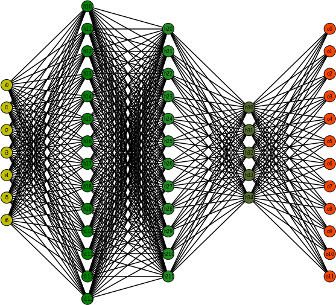
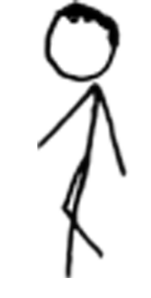
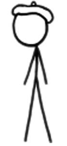

# Advanced Analytics and Experimental Design

<br>

::: {.callout-note title="Today's question"}
How do we move from describing data to making predictions, testing causes, and designing better evidence?
:::

::: notes
This is a first-pass Quarto conversion from the original Week 13 PowerPoint. Keep the pace high and mark places to refine visuals later.
:::

## The Analytics Ladder

<br>

::::::: analytics-ladder
::: ladder-step
Descriptive Analytics
:::

::: ladder-step
Diagnostic Analytics
:::

::: ladder-step
Predictive Analytics
:::

::: ladder-step
Prescriptive Analytics
:::
:::::::

<br>

Complexity and added value usually rise together.

# Advanced Analytics

## Linear Regression

<br>

| General equation | Regression equation | Multiple regression |
|------------------------|------------------------|------------------------|
| `Y = mX + b` | `Y-hat = b0 + b1X` | `Y-hat = b0 + b1X1 + b2X2 + b3X3 + b4X4` |

<br>

::: {.callout-note title="Big idea"}
Regression translates relationships between variables into an equation we can use for explanation or prediction.
:::

## Linear Regression {background-image="media/images/w13_slr.png" background-size="contain" background-position="center" background-color="#ffffff"}

::: {.image-caption .dark}
Simple linear regression fits a line through the pattern in the data.
:::

## Forecasting {background-image="media/images/w13_forecast.png" background-size="contain" background-position="center" background-color="#ffffff"}

::: {.image-caption .dark}
Forecasting extends a pattern forward, with uncertainty.
:::

## Sigmoid Function {background-image="media/images/w13_sigmoid.png" background-size="contain" background-position="center" background-color="#ffffff"}

::: {.image-caption .dark}
The sigmoid curve turns a linear score into a probability-like value.
:::

## Machine Readable Data

<br>

::::::: two-col
:::: col
::: card-title
From human-readable
:::

{fig-alt="Photo prepared for machine reading"}
::::

:::: col
::: card-title
To machine-readable
:::

``` text
[[[ 98 103 102]
  [100 105 104]
  [101 107 106]
  ...
  [ 36  61  77]]]
```
::::
:::::::

<br>

Labeled data becomes training data and test data. Feature engineering decides what the model can see.

## Training a Facial Recognition Model

:::::::: model-flow
::: model-card
{fig-alt="Face image"}

Labeled face
:::

::: flow-arrow
to
:::

::: model-card
{fig-alt="Neural network diagram"}

Deep learning model
:::

::: flow-arrow
to
:::

::: model-card
{fig-alt="Recognized face image"}

Prediction
:::
::::::::

<br>

Adjust. Repeat for many examples. Test on faces the model has not seen.

## Training the Model With Our Data

<br>

1.  Open a picture containing a face.
2.  Convert it to a format the model understands.
3.  Pass the data through the facial recognition model.
4.  Encode the face as an array of numbers.
5.  Compare that encoding to known faces.

## Using the Model With Our Data

::::::: two-col
:::: col
::: card-title
Model work
:::

-   Monitor a video stream for faces
-   Encode faces that can be detected
-   Compare encodings against known people
-   Return the location and name of the detected face
::::

:::: col
::: card-title
Application work
:::

-   Write to a database
-   Write to a log file
-   Send a message
-   Activate a device
-   Alert a person
::::
:::::::

::: notes
The PowerPoint says "Do something useful." This slide separates the model output from the action system that uses it.
:::

## Black Box {background-image="media/images/w13_gorilla.jpeg" background-size="cover" background-position="center"}

::::: method-panel
::: method-title
Models can be powerful and hard to inspect
:::

::: method-subtitle
Advanced analytics often shifts the question from "what happened?" to "how much do we trust what the system decided?"
:::
:::::

## Classification

<br>

::::::::: method-grid
::: method-chip
Support Vector Machine
:::

::: method-chip
K Nearest Neighbors
:::

::: method-chip
Decision Tree
:::

::: method-chip
Random Forest
:::

::: method-chip
Naive Bayes
:::

::: method-chip
Neural Net
:::
:::::::::

## Cluster Analysis

<br>

::::::::: three-col
:::: mini-card
::: card-title
K-Means
:::

Group similar observations.
::::

:::: mini-card
::: card-title
Anomaly Detection
:::

Find observations that do not fit the pattern.
::::

:::: mini-card
::: card-title
Feature Reduction
:::

Keep the signal. Drop the noise.
::::
:::::::::

## ROC Curves

<br>

:::::::: two-col
:::: col
::: card-title
Receiver Operating Characteristic
:::

-   True positive rate
-   False positive rate
-   Threshold
-   Area under the curve
::::

::::: col
:::: roc-box
::: roc-line
:::

[TPR]{.axis .y} [FPR]{.axis .x} [AUC = 80.23%]{.auc}
::::
:::::
::::::::

::: {.callout-tip title="Interpretation"}
A better classifier rises quickly toward high true positives while keeping false positives low.
:::

# Experiments

## Experiments

<br>

:::::::: experiment-equation
::: experiment-card
Subjects
:::

::: experiment-plus
-   
:::

::: {.experiment-card .treatment}
Treatment
:::

::: experiment-plus
=
:::

::: {.experiment-card .outcome}
Outcome
:::
::::::::

## Control Group vs Experimental Group

<br>

::::::: group-compare
:::: group-panel
::: card-title
Control Group
:::

{fig-alt="XKCD person"} {fig-alt="XKCD person"} {fig-alt="XKCD person"}

No treatment or baseline condition.
::::

:::: {.group-panel .experimental}
::: card-title
Experimental Group
:::

{fig-alt="XKCD person"} {fig-alt="XKCD person"} {fig-alt="XKCD person"}

Receives the treatment.
::::
:::::::

## Confounds and Extraneous Variables

<br>

::::::: two-col
:::: col
::: card-title
Confound
:::

A variable that changes with the treatment and could explain the outcome.
::::

:::: col
::: card-title
Extraneous variable
:::

A variable that adds noise or distraction, even if it is not the main explanation.
::::
:::::::

::: {.callout-important title="Design problem"}
If a difference appears after treatment, what else changed at the same time?
:::

## Demand Characteristics

<br>

Things people notice once attention is drawn to them:

-   You hear a crackle in your ears every time you swallow.
-   Your nose is constantly in your peripheral vision.
-   Your clothes and socks are touching your skin.
-   You know where the keys on your keyboard are. Or do yoi?
-   You have blinked several times recently, and your brain edited it out.

::: notes
Use this as a quick class moment: once a respondent guesses the study purpose, their behavior can change.
:::

## Internal Validity {background-image="media/images/w13_black_domino.jpeg" background-size="cover" background-position="center"}

::::: method-panel
::: method-title
Internal Validity
:::

::: method-subtitle
Can we defend that the treatment caused the observed change inside this study?
:::
:::::

## External Validity {background-image="media/images/w13_multi_domino.jpeg" background-size="cover" background-position="center"}

::::: method-panel
::: method-title
External Validity
:::

::: method-subtitle
Can the result travel to other people, places, times, and versions of the treatment?
:::
:::::

# Experimental Designs

## One Shot Design

<br>

:::::: design-flow
::: design-group
Experimental Group
:::

::: design-arrow
Treatment
:::

::: design-result
Post-test
:::
::::::

::: {.callout-note title="Risk"}
With no pre-test or control group, it is hard to know what would have happened otherwise.
:::

## One Group Pretest-Posttest Design

<br>

::::::: design-flow
::: design-group
Experimental Group
:::

::: design-result
Pre-test
:::

::: design-arrow
Treatment
:::

::: design-result
Post-test
:::
:::::::

::: {.callout-note title="Improvement"}
The pre-test gives a baseline, but time and outside events can still explain the change.
:::

## Static Group Design - Quasi-Experimental

<br>

::::::::::: design-stack
:::::: design-flow
::: design-group
Experimental Group
:::

::: design-arrow
Treatment
:::

::: design-result
Post-test
:::
::::::

:::::: design-flow
::: {.design-group .control}
Control Group
:::

::: {.design-arrow .muted}
No treatment
:::

::: design-result
Post-test
:::
::::::
:::::::::::

::: {.callout-important title="Risk"}
The groups may have been different before the treatment began.
:::

## Randomize {background-image="media/images/w13_party.jpg" background-size="cover" background-position="center"}

::::: party-board
::: party-title
Random assignment keeps the party from choosing the groups.
:::

::: party-grid
```         
<span>Free booze</span>
<span>Apps-n-zerts</span>
<span>DJ Mahalanobis</span>
<span>Fun people</span>
<span>Pie</span>
<span>Neat water party</span>
<span>Triscuit inspired crackers</span>
<span>Royalty free music</span>
```
:::
:::::

## Pretest-Posttest Control Group Design

<br>

::::::::::::: design-stack
::::::: design-flow
::: design-group
Experimental Group
:::

::: design-result
Pre-test
:::

::: design-arrow
Treatment
:::

::: design-result
Post-test
:::
:::::::

::::::: design-flow
::: {.design-group .control}
Control Group
:::

::: design-result
Pre-test
:::

::: {.design-arrow .muted}
No treatment
:::

::: design-result
Post-test
:::
:::::::
:::::::::::::

## Posttest Only Control Group Design

<br>

::::::::::: design-stack
:::::: design-flow
::: design-group
Experimental Group
:::

::: design-arrow
Treatment
:::

::: design-result
Post-test
:::
::::::

:::::: design-flow
::: {.design-group .control}
Control Group
:::

::: {.design-arrow .muted}
No treatment
:::

::: design-result
Post-test
:::
::::::
:::::::::::

::: {.callout-tip title="Randomization matters"}
If groups were randomly assigned, posttest-only designs can still support causal claims.
:::

## Factorial Design

<br>

:::::::::::: factorial-grid
::: {.factor-cell .corner}
:::

::: {.factor-cell .header}
Treatment 1
:::

::: {.factor-cell .header}
Treatment 2
:::

::: {.factor-cell .rowhead}
Males
:::

::: factor-cell
{fig-alt="XKCD person"}
:::

::: factor-cell
{fig-alt="XKCD person"}
:::

::: {.factor-cell .rowhead}
Females
:::

::: factor-cell
{fig-alt="XKCD person"}
:::

::: factor-cell
{fig-alt="XKCD person"}
:::
::::::::::::

## ANOVA Names

<br>

ANOVA names tell us:

1.  how many independent variables are in the design
2.  how the variables were measured
3.  whether covariates or multiple outcomes are included

<br>

::::::::: {.method-grid .compact}
::: method-chip
One-way independent ANOVA
:::

::: method-chip
Two-way independent ANOVA
:::

::: method-chip
Two-way mixed ANOVA
:::

::: method-chip
Three-way repeated measures ANOVA
:::

::: method-chip
Two-way repeated measures ANCOVA
:::

::: method-chip
Three-way mixed MANCOVA
:::
:::::::::

## Two-way ANOVA

<br>

::::::::: anova-map
::: anova-total
Total Variability
:::

::: anova-branch
Systematic Variation
:::

::: anova-branch
Unsystematic Variation
:::

::: anova-leaf
Variable A
:::

::: anova-leaf
Variable B
:::

::: anova-leaf
Interaction of A and B
:::
:::::::::

<br>

`SS Total = SS Model + SS Residual`

## Two Way ANOVA {background-image="media/images/w13_factors.png" background-size="contain" background-position="center" background-color="#ffffff"}

::: {.image-caption .dark}
Interaction between factors: the effect of one variable depends on the level of another.
:::

# Wrap Up

## What changes as analytics gets advanced?

<br>

-   We move from describing patterns to predicting, classifying, and optimizing.
-   Models need training data, test data, and validation.
-   Experiments need comparison groups, randomization, and clear outcomes.
-   Factorial designs let us study multiple causes at once.

::: {.callout-tip title="Prime directive"}
Ask what evidence would make the claim defensible.
:::

## Exit Question

<br>

Pick one advanced analytics or experiment example from today.

<br>

Answer:

1.  What outcome is being predicted, classified, or changed?
2.  What could bias the result?
3.  What design choice would make the evidence stronger?